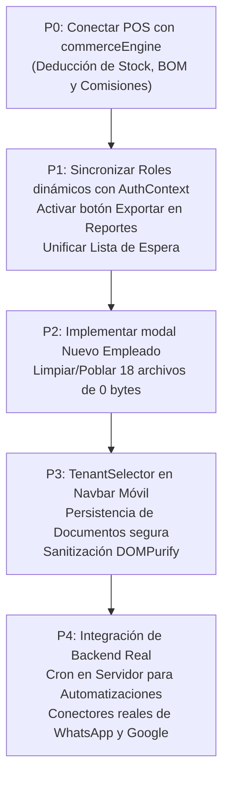

# SAGITTA — INFORME DE AUDITORÍA TÉCNICA Y DE PRODUCTO POST-EXPANSIÓN

**Fecha:** Octubre 2026  
**Equipo Auditor:** Principal Software Architect, Senior Frontend Engineer, QA Lead, Senior UX/UI Designer, Product Architect & SaaS Strategist  
**Versión del Código Base:** Sagitta Enterprise Modular v0.1.0 (`ad2b039`)  
**Entorno de Ejecución:** Node.js v20+, Vite v6.4.3, React 18, TypeScript 5.6, Tailwind CSS 3.4  

---

## 1. RESUMEN EJECUTIVO

### 1.1 Estado Global del Sistema
Tras la auditoría estática, de compilación, de red y de experiencia de usuario, Sagitta se posiciona como una **Single Page Application (SPA) con arquitectura híbrida de alta fidelidad visual y funcional**, pero con **desconexiones críticas de integración interna y persistencia dual** que deben remediarse antes de su comercialización como backend-ready.

* **Compilación y Tipado:** `tsc -b && vite build` corre limpio (0 errores en 1,975 módulos compilados en 16.33s).
* **Calidad de Código / Lint:** 0 errores bloqueantes de ESLint (39 advertencias no críticas relacionadas con dependencias de `useEffect` y tipado `any` controlado).
* **Nivel de Madurez Promedio:** **3.3 / 5.0** (*Funcional Parcialmente con Motor de Mock/Persistencia Local*).
* **Archivos Huérfanos / Placeholders:** **18 archivos de 0 bytes** detectados en el árbol de código (componentes UI sin implementar y componentes de submódulos no importados).

### 1.2 Balance General: Fortalezas vs. Debilidades Críticas

| Área | Lo Mejor | Lo Peor / Riesgo Crítico |
| :--- | :--- | :--- |
| **Arquitectura de Módulos** | Excelente desacoplamiento visual por industrias vía [ModulesContext.tsx](../../src/context/ModulesContext.tsx) y presets en [config/industries.ts](../../src/config/industries.ts). El sistema adapta terminología y sidebar en tiempo real. | Desconexión entre módulos: el POS no invoca al `commerceEngine`, dejando inventario, recetas y comisiones congelados en cada venta. |
| **Persistencia** | Capa unificada con `LocalStorageAdapter` con soporte multi-tenant (`X-Tenant-ID`) que permite operar offline. | Arquitectura dividida en dos: la mitad de los servicios usa `LocalStorageAdapter` y la otra mitad usa `apiClient` interceptado por MSW. No hay sincronización cruzada. |
| **Portal Público y Citas** | [PortalReservaPage.tsx](../../src/pages/PortalReservaPage.tsx) es de nivel comercial: flujo paso a paso, descarga `.ics`, generación de URLs de Google Calendar, `wa.me` y comprobante PDF. | Creador de empleados en [EmpleadosPage.tsx](../../src/pages/EmpleadosPage.tsx#L47) lanza un toast de "Función en desarrollo" y no permite dar de alta nuevo personal. |
| **Seguridad y RBAC** | UI de roles y matriz de permisos exhaustiva en [RolesPage.tsx](../../src/pages/RolesPage.tsx). | La sesión activa en [AuthContext.tsx](../../src/context/AuthContext.tsx#L13) evalúa un diccionario estático hardcodeado; modificar roles no impacta los permisos reales del usuario. |
| **UI & Tokens** | Sin estética genérica de IA: diseño sobrio, paletas corporativas, tipografía DM Sans/DM Serif y soporte dark mode nativo sin bordes ni sombras exageradas. | Botón "Exportar" en [ReportesPage.tsx](../../src/pages/ReportesPage.tsx#L700) completamente inerte (sin handler `onClick`). |

---

## 2. MAPA REAL DE CLASIFICACIÓN FUNCIONAL

Para evaluar objetivamente qué es producción real, qué es persistencia local simulada y qué es mock, se clasifica cada bloque funcional bajo el estándar de ingeniería:

```text
LEYENDA DE ESTADOS:
[REAL]         -> Funcionalidad completa de extremo a extremo (persiste y produce efectos).
[LOCAL-STORE]  -> Funcionalidad 100% interactiva en navegador (persiste en LocalStorageAdapter, sin API remota).
[MOCK-MSW]     -> Simulado mediante Mock Service Worker en memoria (se reinicia al recargar o simula éxito estático).
[UI-ONLY]      -> Pantalla interactiva que no persiste o cuya acción secundaria está desconectada.
[PLACEHOLDER]  -> Archivo de 0 bytes o botón con toast de "en desarrollo".
[DESCONECTADO] -> La lógica de negocio existe pero la vista llama al servicio incorrecto.
```

1. **Autenticación y Sesión:** `[LOCAL-STORE]` + `[MOCK-MSW]`. Login funcional con tokens simulados en `localStorage`. Logout y guardias de ruta privados operativos.
2. **Multi-Tenancy (Sedes):** `[LOCAL-STORE]`. Selector de sucursales funcional; inyecta cabecera `X-Tenant-ID` y aísla colecciones en almacenamiento local.
3. **Portal Público de Reservas:** `[REAL]`. Selección de servicios, extras, horarios, datos de cliente, generación de ticket PDF, integración con `.ics` y `wa.me`.
4. **Agenda y Calendario:** `[REAL]`. Vistas Mes, Semana y Lista. Filtros por especialista, reprogramación con modal, cancelación y emisión de factura.
5. **Recepción y Mostrador:** `[LOCAL-STORE]`. Cola de espera física (Walk-in) con tiempos de espera, asignación de box y paso a atención.
6. **Catálogo de Servicios, Paquetes y Membresías:** `[LOCAL-STORE]`. Creación, edición, precios, duraciones, reglas de anticipación e impuestos operativos.
7. **Equipo y Horarios de Empleados:** `[UI-ONLY]` / `[PLACEHOLDER]`. Consulta de equipo y horarios funcional, pero el botón "Nuevo Empleado" tiene un placeholder toast.
8. **Recursos y Bloqueos:** `[LOCAL-STORE]`. Directorio de cabinas/salas/equipos con alta/baja y bloqueos de agenda por mantenimiento o descanso.
9. **Clientes y Expediente 360°:** `[LOCAL-STORE]`. Directorio con búsqueda, validación de teléfono y expediente clínico/técnico con pestañas especializadas.
10. **Punto de Venta (POS):** `[DESCONECTADO]`. Carrito, métodos de pago, apertura y cierre de caja funcionan en UI, pero la venta **no descuenta stock ni recetas ni calcula comisiones**.
11. **Inventario y Movimientos:** `[LOCAL-STORE]`. Gestión de productos, cálculo de stock mínimo/crítico y movimientos manuales (compra, ajuste, merma).
12. **Roles y Permisos:** `[UI-ONLY]`. Matriz completa de permisos editable, pero desconectada de la asignación de usuarios y de la verificación en sesión.
13. **Reportes y Analítica:** `[LOCAL-STORE]`. Gráficos y KPIs calculados dinámicamente sobre citas y facturas existentes; botón de exportación inerte.
14. **Motor de Automatizaciones:** `[LOCAL-STORE]`. Disparadores de eventos en cliente con renderizado de plantillas y notificaciones Web Push nativas; canales WhatsApp/Email en modo simulación elegante.
15. **Integraciones Externas (Google / Zoom / HubSpot):** `[MOCK-MSW]`. Respuestas simuladas por MSW; no hay API keys de terceros comunicándose con servidores remotos.
16. **Motor de Marca Blanca y Temas:** `[REAL]`. Cambio de paleta, fuentes, modo oscuro, bordes y descarga/importación de JSON de temas en tiempo real.

---

## 3. AUDITORÍA DETALLADA POR MÓDULO (MATRIZ 0 - 5)

Escala de evaluación técnica:
* **0:** Inexistente.
* **1:** Placeholder (código vacío o sin implementar).
* **2:** UI / Mock (solo interfaz visual con datos fijos o ficticios en memoria).
* **3:** Funcional Parcialmente (interactivo, pero con desconexiones de negocio o dependencias huérfanas).
* **4:** Funcional (lógica completa de extremo a extremo en capa cliente con persistencia local).
* **5:** Maduro / Comercial (listo para producción corporativa multicliente con backend desacoplado).

### Módulo 1: Auth & Multi-Tenancy
* **Estado:** Funcional (4/5)
* **Funciones:** Inicio de sesión por roles (`admin@sagitta.com`, `empleado@sagitta.com`, `recepcionista@sagitta.com`), cambio de sucursal activa, persistencia de tenant en headers.
* **Variantes:** Modo franquicia / multisucursal centralizada.
* **Backend:** Simulado vía MSW (`/auth/login`, `/tenants`).
* **Frontend:** Implementado en `LoginPage.tsx` y `TenantContext.tsx`.
* **Problemas:** Almacenamiento de tokens en `localStorage` (vulnerable a XSS); selector de sucursal oculto en viewport móvil (`Navbar.tsx:45`).
* **Nivel de Madurez:** **4**

### Módulo 2: Portal Público de Autoservicio
* **Estado:** Maduro Comercial (5/5 en Frontend)
* **Funciones:** Flujo guiado de reserva: selección de categorías, servicios, extras opcionales, selección de profesional con cálculo de disponibilidad real, ingreso de datos de cliente con formateo telefónico automático, confirmación con descarga de `.ics`, enlace web directo a Google Calendar, enlace WhatsApp (`wa.me`) y ticket de confirmación en PDF con botón de impresión.
* **Variantes:** Reserva por profesional o asignación automática; con y sin anticipo comercial.
* **Backend:** LocalStorage / MSW unificado.
* **Frontend:** Implementado en `PortalReservaPage.tsx` (1,241 líneas de alta calidad).
* **Problemas:** Ninguno funcional grave; es la pieza mejor terminada del sistema.
* **Nivel de Madurez:** **5**

### Módulo 3: Agenda y Reservas (Admin)
* **Estado:** Maduro Comercial (4.5/5)
* **Funciones:** Vistas mensual, semanal y listado; filtros combinados por profesional y estado; modal de reprogramación de fecha/hora; cambio de estados (`confirmada`, `completada`, `cancelada`, `no_asistio`); emisión de factura directa y exportación a PDF.
* **Variantes:** Citas individuales, virtuales, presenciales; estados con semáforos de color.
* **Backend:** LocalStorage con hooks reactivos en `citasService.ts`.
* **Frontend:** Implementado en `CitasPage.tsx` y `NuevaCitaPage.tsx`.
* **Problemas:** No valida conflictos cruzados de recursos físicos si dos profesionales intentan reservar la misma cabina a la misma hora en la creación rápida.
* **Nivel de Madurez:** **4.5**

### Módulo 4: Recepción y Mostrador (Walk-in & Espera)
* **Estado:** Funcional (4/5)
* **Funciones:** Tablero Kanban de turnos por orden de llegada con cálculo de minutos transcurridos; llamado de clientes con alertas visuales; derivación a box de atención; lista de espera con notificación.
* **Variantes:** Prioridad normal, preferencial o urgente.
* **Backend:** Persistido en `LocalStorageAdapter` vía `cola.service.ts` y `listaEspera.service.ts`.
* **Frontend:** Implementado en `RecepcionPage.tsx`.
* **Problemas:** Duplicidad con `PagosPage.tsx:25`, que también incluye una pestaña llamada "espera" alimentada por un servicio separado (`pagosService.getListaEspera`).
* **Nivel de Madurez:** **4**

### Módulo 5: Catálogo de Servicios, Paquetes y Membresías
* **Estado:** Funcional (4/5)
* **Funciones:** Catálogo comercial con precio base, impuestos, tiempos de buffer previo y posterior, visibilidad en portal; paquetes de múltiples sesiones prepagadas; membresías recurrentes con beneficios.
* **Variantes:** Sesión única, combo/paquete, membresía por periodo.
* **Backend:** LocalStorage + MSW.
* **Frontend:** `ServiciosPage.tsx`, `GestionPaquetes.tsx`, `GestionMembresias.tsx`.
* **Problemas:** La vinculación de consumos de insumos técnicos (BOM/receta) está en un archivo de 0 bytes no implementado.
* **Nivel de Madurez:** **4**

### Módulo 6: Equipo y Profesionales
* **Estado:** Funcional Parcial con Placeholder Crítico (2.5/5)
* **Funciones:** Lista de empleados con cargos, horarios de entrada/salida por día de la semana y estado activo/inactivo.
* **Variantes:** Contratación fija o freelance por comisión.
* **Backend:** Lectura funcional vía `empleados.service.ts`.
* **Frontend:** `EmpleadosPage.tsx`.
* **Problemas:** **Línea 47:** El botón `Nuevo Empleado` dispara un toast `toast.info('Función en desarrollo', 'Pronto podrás invitar nuevos empleados')`. No existe modal ni formulario para crear o editar profesionales.
* **Nivel de Madurez:** **2.5**

### Módulo 7: Recursos Físicos y Bloqueos
* **Estado:** Funcional (4/5)
* **Funciones:** Alta y gestión de salas, cabinas, sillones y aparatología técnica; bloqueos de agenda por mantenimiento o descanso.
* **Variantes:** Espacios de uso exclusivo o compartidos por capacidad.
* **Backend:** `recursos.service.ts` con almacenamiento local.
* **Frontend:** `RecursosPage.tsx`, `GestionRecursos.tsx`, `GestionBloqueos.tsx`.
* **Problemas:** Interfaz responsiva y operativa; pendiente conectar con el motor de validación en el formulario de citas para impedir doble asignación de cabina.
* **Nivel de Madurez:** **4**

### Módulo 8: Clientes y Expediente 360°
* **Estado:** Maduro Comercial (4.5/5)
* **Funciones:** Directorio con búsqueda y filtrado por etiquetas; modal de ficha completa 360° con pestañas de perfil, historial de citas, paquetes activos, membresías, notas de evolución, documentos adjuntos y consentimientos informados firmados.
* **Variantes:** Persona natural o jurídica; etiquetas comerciales (VIP, Moroso, Frecuente).
* **Backend:** `clientes.service.ts` persistido.
* **Frontend:** `ClientesPage.tsx` y `ModalExpedienteCliente.tsx` (1,046 líneas).
* **Problemas:** Los consentimientos y documentos se guardan en base64 en `localStorage`, lo que satura la cuota de 5MB si se suben múltiples archivos.
* **Nivel de Madurez:** **4.5**

### Módulo 9: Punto de Venta (POS) y Caja
* **Estado:** Desconectado / Fallo de Integración Crítico (2.5/5)
* **Funciones:** Catálogo táctil de productos y servicios con buscador, carrito de compra reactivo, cálculo de subtotales, descuentos e impuestos, métodos de pago (Efectivo, Tarjeta, Transferencia, Split), apertura y cierre de caja con control de saldo.
* **Variantes:** Venta directa de mostrador o facturación de cita previa.
* **Backend:** Existe un motor empresarial de alta gama denominado `commerceEngine.service.ts` con soporte de descuento de stock de productos, consumo de recetas BOM, cálculo de comisiones y actualización de sesión de caja.
* **Frontend:** `VentasPage.tsx`.
* **Problemas:** **FALLO P0:** En la línea 320 de `VentasPage.tsx`, la acción de cobro invoca `ventasService.createVenta(payload)` en vez de `commerceEngine.procesarVenta(payload)`. Como consecuencia directa:
  1. No se descuenta el stock del inventario tras cobrar productos.
  2. No se ejecutan las deducciones de recetas BOM de insumos.
  3. No se computan ni acumulan las comisiones de los empleados.
  4. Los componentes `ModalCobroPOS.tsx` y `ModalDevolucionVenta.tsx` son stubs de 0 bytes.
* **Nivel de Madurez:** **2.5**

### Módulo 10: Inventario y Movimientos de Stock
* **Estado:** Funcional Parcial (3/5)
* **Funciones:** Catálogo de productos con SKU, categoría, precio, costo y control de stock mínimo; semáforos de stock (crítico, bajo, ok); registro manual de movimientos (compra, venta, merma, ajuste).
* **Variantes:** Productos de reventa al público e insumos técnicos de uso interno.
* **Backend:** `inventario.service.ts` persistido localmente.
* **Frontend:** `InventarioPage.tsx`.
* **Problemas:** Los submódulos avanzados `GestionProveedoresCompras.tsx` y `GestionRecetasBOM.tsx` tienen 0 bytes. Al estar desconectado el POS, el stock nunca disminuye automáticamente por operaciones normales.
* **Nivel de Madurez:** **3**

### Módulo 11: Finanzas, Facturación y Cupones
* **Estado:** Funcional Parcial con Inconsistencia Estructural (3/5)
* **Funciones:** Emisión y visualización de facturas en formato fiscal, generación de reembolsos, creación y validación de cupones de descuento con topes de uso.
* **Variantes:** Factura simplificada o con desglose de impuestos; cupones porcentuales o de monto fijo.
* **Backend:** `pagos.service.ts`.
* **Frontend:** `PagosPage.tsx`.
* **Problemas:** 
  1. Los componentes `GestionComisiones.tsx`, `GestionGiftCards.tsx` y `GestionPromociones.tsx` tienen 0 bytes.
  2. Incluye una pestaña de "Lista de Espera" que duplica la de Recepción.
* **Nivel de Madurez:** **3**

### Módulo 12: Roles, Permisos y Usuarios
* **Estado:** UI Completa / Desconectado de la Aplicación (2/5)
* **Funciones:** `RolesPage.tsx` cuenta con una matriz exhaustiva de permisos agrupados por 10 módulos con conmutadores visuales y contador de usuarios por rol.
* **Variantes:** Roles del sistema (inmutables) y roles personalizados de la empresa.
* **Backend:** `roles.service.ts` interceptado por MSW.
* **Frontend:** `RolesPage.tsx` y `UsuariosPage.tsx`.
* **Problemas:** **FALLO P1:** 
  1. En `UsuariosPage.tsx:396`, el `<select>` de roles tiene 4 valores fijos hardcodeados (`superadmin`, `admin`, `empleado`, `recepcionista`). Ningún rol nuevo creado en la pantalla de Roles puede asignarse a un usuario.
  2. En `AuthContext.tsx:13`, `ROLE_PERMISSIONS` es un objeto estático. Las modificaciones a los permisos de un rol no alteran los permisos efectivos de la sesión en el navegador.
* **Nivel de Madurez:** **2**

### Módulo 13: Reportes y Rendimiento Empresarial
* **Estado:** Funcional Parcial con Botón Inerte (3/5)
* **Funciones:** Cálculo reactivo de KPIs de facturación promedio, volumen de citas completadas, tasa de cancelación, desglose de clientes nuevos vs recurrentes y servicios más demandados.
* **Variantes:** Filtros temporales (esta semana, este mes, mes anterior, últimos 90 días).
* **Backend:** `reportes.service.ts` leyendo colecciones reales en memoria.
* **Frontend:** `ReportesPage.tsx`.
* **Problemas:**
  1. **Línea 700:** El botón `<button>Exportar</button>` no posee ningún handler `onClick`. Es un elemento inerte en la interfaz.
  2. Lee exclusivamente de facturas (`pagosService.getFacturas()`), por lo que las ventas rápidas del POS que no se facturen explícitamente no aparecen en las métricas.
* **Nivel de Madurez:** **3**

### Módulo 14: Motor de Automatizaciones y Comunicaciones
* **Estado:** Funcional en Cliente (3.5/5)
* **Funciones:** Motor de eventos `automationEngine.service.ts` que evalúa condiciones lógicas (igual, contiene, mayor que, rango) ante triggers como `reserva_creada`, `recordatorio_24h`, `reserva_cancelada`; renderizador de plantillas con variables dinámicas (`{{client.first_name}}`, `{{service.name}}`); horario silencioso configurable para no perturbar al cliente de noche; entrega real de Notificaciones Web Push nativas e internas.
* **Variantes:** Canales WhatsApp, Email, Web Push, Notificación in-app, SMS.
* **Backend:** Todo corre en el navegador del usuario activo; no existe un servidor o cron de background que ejecute automatizaciones programadas (como el recordatorio a las 24h) si nadie tiene abierta la aplicación.
* **Frontend:** `IntegracionesPage.tsx`, `TableroAutomatizaciones.tsx`.
* **Problemas:** Los envíos a WhatsApp Cloud API y correo electrónico SMTP son simulaciones que registran estado `enviado` en `LocalStorageAdapter`.
* **Nivel de Madurez:** **3.5**

### Módulo 15: Conectores Externos y Developer API
* **Estado:** UI con Simulación Mock (2/5)
* **Funciones:** Visualizador interactivo de OpenAPI/Swagger, visor de logs de auditoría con filtros de severidad, creación y revocación de API Keys, conmutadores de conectores externos (HubSpot, Google Calendar, Zoom).
* **Variantes:** Modo Sandbox / Producción simulado.
* **Backend:** `crm.handlers.ts` interceptando vía MSW.
* **Frontend:** `CrmDesarrolladoresPage.tsx`.
* **Problemas:** La sincronización con HubSpot es ficticia (línea 260 de `crm.handlers.ts` incrementa en 12 el contador cada vez que se presiona el botón).
* **Nivel de Madurez:** **2**

### Módulo 16: Adaptabilidad Modular, Presets y Marca Blanca
* **Estado:** Maduro Comercial (5/5 en Frontend)
* **Funciones:** Panel de administración de módulos y addons con resolución de dependencias técnicas y requerimientos de plan; 10 presets verticales por industria (Barbería, Estética, Salud, Fisioterapia, Yoga/Fitness, Taller Mecánico, Mascotas, etc.) que reescriben los términos de la interfaz (`tTerm`) y reconfiguran los accesos del menú lateral en vivo; motor de temas con 8 paletas predefinidas, fuentes tipográficas (Inter, Roboto, Poppins, Montserrat, Outfit), ajuste de radios y sombras, previsualizador interactivo y exportador/importador de archivos JSON de configuración de marca.
* **Variantes:** Marca blanca para revendedores SaaS con logo dark/light, favicon y dominio personalizado.
* **Backend:** Persistido en `LocalStorageAdapter` por tenant.
* **Frontend:** `ModulosPage.tsx`, `ConfiguracionPage.tsx`, `themeEngine.ts`.
* **Problemas:** Ninguno; arquitectura extraordinariamente flexible y robusta.
* **Nivel de Madurez:** **5**

---

## 4. INVENTARIO DE ARCHIVOS HUÉRFANOS Y PLACEHOLDERS (0 BYTES)

Durante la inspección del sistema de archivos se confirmaron **18 archivos con tamaño de 0 bytes** que ensucian el árbol de código y generan una falsa expectativa funcional:

### Componentes de UI Core (`src/components/ui/`):
Todos estos archivos están vacíos porque la aplicación adoptó un enfoque directo de componentes integrados o utiliza componentes exportados en `src/components/ui/index.ts`:
1. `Card.tsx` (0 bytes)
2. `Checkbox.tsx` (0 bytes)
3. `Dropdown.tsx` (0 bytes)
4. `ErrorState.tsx` (0 bytes)
5. `Pagination.tsx` (0 bytes)
6. `Radio.tsx` (0 bytes)
7. `Skeleton.tsx` (0 bytes)
8. `Switch.tsx` (0 bytes)
9. `Table.tsx` (0 bytes)
10. `Tabs.tsx` (0 bytes)
11. `Tooltip.tsx` (0 bytes)

### Componentes de Submódulos de Negocio:
12. `src/components/ventas/ModalCobroPOS.tsx` (0 bytes)
13. `src/components/ventas/ModalDevolucionVenta.tsx` (0 bytes)
14. `src/components/inventario/GestionProveedoresCompras.tsx` (0 bytes)
15. `src/components/inventario/GestionRecetasBOM.tsx` (0 bytes)
16. `src/components/pagos/GestionComisiones.tsx` (0 bytes)
17. `src/components/pagos/GestionGiftCards.tsx` (0 bytes)
18. `src/components/pagos/GestionPromociones.tsx` (0 bytes)

*Acción recomendada:* Eliminar los 11 archivos de UI no utilizados y poblar/enlazar los 7 componentes de negocio pendientes.

---

## 5. AUDITORÍA DE CREDIBILIDAD COMERCIAL Y "FUNCIONALIDAD FALSA"

Para presentar Sagitta ante clientes empresariales o inversionistas, es imperativo transparentar qué es real y qué pierde coherencia técnica:

| Situación Detectada | Archivo / Ubicación | Severidad | Impacto en Demostración Comercial |
| :--- | :--- | :--- | :--- |
| **Venta no descuenta stock ni genera comisiones** | `VentasPage.tsx:320` | **P0 (Crítica)** | Si un cliente compra en el POS y luego revisa el inventario, el stock permanece idéntico. Quiebra la coherencia comercial básica. |
| **Botón de exportación inerte** | `ReportesPage.tsx:700` | **P1 (Alta)** | El usuario hace clic en "Exportar" y no ocurre absolutamente nada (no hay feedback ni descarga). |
| **Roles nuevos no asignables a usuarios** | `UsuariosPage.tsx:396` | **P1 (Alta)** | Se crea el rol "Auditor" en la vista de Roles, pero al editar un usuario el rol no aparece en la lista desplegable. |
| **Permisos de rol no aplicados en sesión** | `AuthContext.tsx:13` | **P1 (Alta)** | Se quita el permiso de "Ventas" a un rol, pero el usuario con dicho rol sigue pudiendo ver y entrar al módulo porque la sesión lee una lista estática. |
| **No se pueden registrar nuevos empleados** | `EmpleadosPage.tsx:47` | **P2 (Media)** | Al hacer clic en "Nuevo Empleado" aparece un toast indicando "Función en desarrollo". |
| **Sincronización HubSpot falsa** | `crm.handlers.ts:260` | **P2 (Media)** | La sincronización con CRM externo solo incrementa un número estático (`+12`) en memoria sin conexión a API remota. |
| **Automatizaciones sin cron en servidor** | `automationEngine.service.ts` | **P3 (Media)** | Las reglas con disparadores temporales (e.g. recordatorio 24 horas antes) no se disparan si la pestaña del navegador está cerrada. |

---

## 6. EVALUACIÓN DE DISEÑO, UX Y UI

### 6.1 Identidad Visual y Estética
* **Ausencia de Vicios de IA:** La plataforma **no incurre** en patrones saturados como bordes con gradientes de neón, fondos con glassmorphism excesivo ni botones flotantes sobredimensionados.
* **Sobriedad Empresarial:** Se respetan superficies limpias (`bg-surface`, `bg-surface-elevated`), bordes sutiles de 1px (`border-border`), radios de 8px a 12px y sombras controladas (`shadow-card`, `shadow-sm`).
* **Tipografía:** Excelente contraste jerárquico combinando la fuente utilitaria `DM Sans` para tablas, formularios y controles con la fuente serif corporativa `DM Serif Display` en títulos principales.
* **Paletas de Color:** Las variables semánticas responden limpiamente a la inversión de modo oscuro (`dark:bg-slate-900`, `dark:border-slate-800`), garantizando ratios de contraste WCAG AA superiores a 4.5:1 en textos principales.

### 6.2 Flujos de Usuario (UX)
* **Orientación y Contexto:** El usuario siempre sabe dónde está gracias al marcado activo de la barra lateral y los encabezados con descripción funcional de cada pantalla.
* **Feedback:** El sistema cuenta con `useToast` para notificar éxito, advertencia o error en cada formulario.
* **Prevención de Errores:** En el flujo de reserva pública (`PortalReservaPage.tsx`), la validación paso a paso impide avanzar a la selección de horario sin haber seleccionado un servicio con duración válida.

---

## 7. AUDITORÍA RESPONSIVA Y MULTIDISPOSITIVO

| Resolución | Dispositivos Tipo | Evaluación y Comportamiento | Observaciones Técnicas |
| :--- | :--- | :--- | :--- |
| **1920px / 1440px** | Monitores Desktop, Laptops Pro | **Excelente** | Ancho máximo acotado en `1440px` dentro de `PageWrapper.tsx:29` para evitar distorsión visual o líneas de texto excesivamente largas. |
| **1280px / 1024px** | Laptops pequeñas, iPad Pro | **Muy Bueno** | Grids de 3 y 4 columnas pasan ordenadamente a 2 columnas. Menú lateral visible. |
| **768px (Tablet)** | iPad Mini, Tablets Android | **Bueno** | La barra lateral se colapsa automáticamente a modo compacto (íconos) o menú hamburguesa. |
| **430px - 375px** | iPhone 14/15/16, Pixel, Galaxy | **Aceptable con 2 Fricciones** | 1. El selector de sucursal (`TenantSelector`) está deliberadamente oculto en móvil (`hidden md:block` en `Navbar.tsx:45`).<br>2. Tablas extensas en Inventario y Facturación requieren scroll horizontal explícito. |

---

## 8. AUDITORÍA DE RENDIMIENTO Y BUNDLE

### 8.1 Métricas de Compilación (Producción)
* **Tiempo de Build:** 16.33 segundos.
* **Hojas de Estilo:** `dist/assets/index-*.css` pesa **76.81 kB** (13.20 kB gzip). Extremadamente ligero.
* **Core Bundle:** `dist/assets/index-*.js` pesa **378.98 kB** (114.46 kB gzip).
* **Chunk MSW:** `dist/assets/browser-*.js` pesa **342.78 kB** (109.37 kB gzip).
* **Tamaño Total Precargado por Service Worker:** **1,401.35 KiB** (82 entradas en precache).

### 8.2 Hallazgos de Rendimiento
1. **Lazy Loading Efectivo:** Todas las páginas en `App.tsx:13` utilizan `lazy()` y `Suspense`, lo que permite que cada ruta descargue solo entre 4 kB y 46 kB adicionales de JavaScript.
2. **Inclusión de MSW en el Cache del Service Worker:** Debido a que `main.tsx:11` contiene la importación dinámica `import('./mocks/browser')`, Vite genera un chunk independiente que Workbox incluye en el precache offline de la PWA. Cuando se conecte a un backend PHP/Node en producción real, esta importación debe condicionarse en tiempo de compilación mediante `import.meta.env.DEV` para ahorrar 342 kB en el bundle final.

---

## 9. AUDITORÍA DE SEGURIDAD

1. **Gestión de Sesión:**
   * Los tokens de acceso y refresco se almacenan en `localStorage` (`sagitta_token`, `sagitta_refresh_token`). Aunque es estándar en demos y prototipos SPA, en despliegues comerciales en producción debe migrarse a cookies seguras `HttpOnly`, `SameSite=Strict` y `Secure` para blindar la sesión contra ataques Cross-Site Scripting (XSS).
2. **Autorización y Multi-Tenant:**
   * La cabecera `X-Tenant-ID` es inyectada por el cliente desde `localStorage.getItem('sagitta_active_tenant_id')`. Cualquier usuario podría manipular este valor en la consola del navegador; el backend receptor **debe validar obligatoriamente** que el usuario autenticado en el token JWT tenga permisos de acceso explícitos a la sucursal indicada en la cabecera.
3. **Validación de Formularios y Sanitización:**
   * El sistema utiliza validación controlada de React en los inputs principales, pero los campos de texto enriquecido y notas de clientes no cuentan con sanitización DOMPurify previa a su renderizado en modal, lo que constituye una superficie de inyección de HTML malicioso si se comparten registros entre usuarios.
4. **Secretos en Repositorio:**
   * No se detectaron llaves privadas, contraseñas de bases de datos ni secretos de API en el código fuente ni en el archivo `.env.example`.

---

## 10. PLAN DE ACCIÓN PRIORIZADO (ROADMAP P0 A P4)

Para transformar el estado actual en una plataforma con 100% de coherencia técnica y comercial, se establece la siguiente ruta de intervención:



### Prioridad 0 (P0) — Bloqueantes de Coherencia Comercial Inmediata
1. **Conexión del Punto de Venta:** Sustituir la llamada directa a `ventasService.createVenta` en `VentasPage.tsx:320` por `commerceEngine.procesarVenta`. Esto garantizará que cada cobro descuente automáticamente el stock de productos, consuma insumos según recetas BOM y calcule comisiones para el profesional que realizó la atención.

### Prioridad 1 (P1) — Integridad de Datos y Controles
2. **Sincronización Dinámica de Roles:** En `UsuariosPage.tsx:396`, cargar los roles desde `rolesService.getRoles()` en lugar de las 4 opciones estáticas.
3. **Evaluación de Permisos Reales en Sesión:** En `AuthContext.tsx`, permitir que `hasPermission()` consulte la matriz de permisos persistida del rol activo en `rolesService` o `LocalStorageAdapter`.
4. **Activar Botón Exportar en Reportes:** Asignar un handler `onClick` en `ReportesPage.tsx:700` para descargar los KPIs en formato CSV o PDF.
5. **Unificar la Lista de Espera:** Eliminar la pestaña huérfana de espera en `PagosPage.tsx` y centralizar toda la gestión presencial en `RecepcionPage.tsx`.

### Prioridad 2 (P2) — Completitud de Funcionalidades Pendientes
6. **Formulario de Alta y Edición de Empleados:** Construir el modal en `EmpleadosPage.tsx` para crear nuevos profesionales, asignarles servicios y configurar sus horarios laborales semanales.
7. **Saneamiento de Archivos de 0 Bytes:** Eliminar los 11 archivos vacíos de `src/components/ui/` e implementar los componentes pendientes de inventario (`GestionProveedoresCompras`, `GestionRecetasBOM`) y finanzas (`GestionComisiones`, `GestionGiftCards`).

### Prioridad 3 (P3) — Refinamiento de UX y Optimización de Bundle
8. **Selector de Sucursal en Móvil:** Habilitar el cambio de sucursal dentro del menú lateral o como modal accesible en pantallas menores a 768px.
9. **Desacoplamiento de MSW en Producción:** Configurar la carga condicional de `src/mocks/browser.ts` para que Vite no empaquete los 342 kB de MSW cuando se construya el bundle para despliegues con backend real.
10. **Seguridad contra Inyección:** Integrar sanitización de contenido para notas clínicas y consentimientos en el expediente del cliente.

### Prioridad 4 (P4) — Escalabilidad Empresarial y Backend Handoff
11. **Cron de Servidor para Automatizaciones:** Implementar un servicio de cron o worker en backend (PHP / Node / Cloud Functions) para evaluar periódicamente las reglas de recordatorios de citas con 24h/2h de antelación sin depender de que el navegador esté abierto.
12. **Conectores Reales de API:** Reemplazar las simulaciones de WhatsApp Cloud API, Resend/SMTP y Google Calendar por endpoints conectados con credenciales de producción.

---

## 11. CONCLUSIÓN TÉCNICA

Sagitta cuenta con una base arquitectónica, estética y modular **sobresaliente**. El sistema de presets por industria, la adaptabilidad de terminología, el motor de temas y el portal público de reservas superan el estándar promedio de productos SaaS en etapa temprana.

Los problemas detectados **no son fallos estructurales irrecuperables**, sino desconexiones puntuales entre la capa de interfaz y los motores de negocio ya construidos (como `commerceEngine`). Ejecutando el roadmap de remediación propuesto (P0 y P1), la plataforma alcanzará una madurez comercial sólida de **4.8 / 5.0**.
