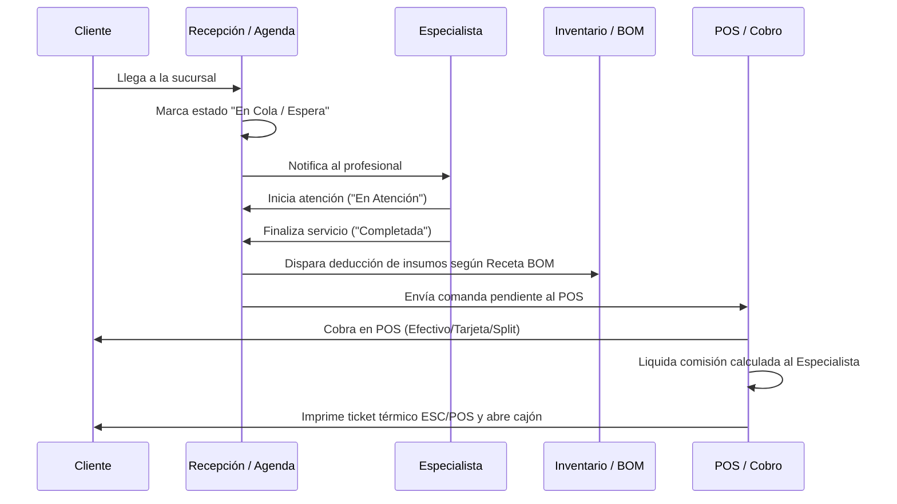
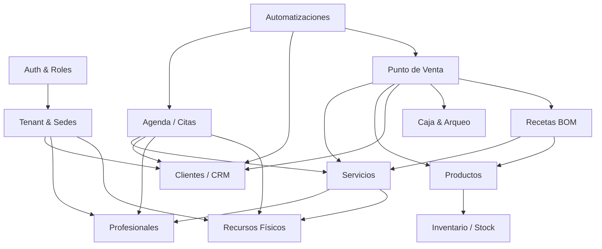
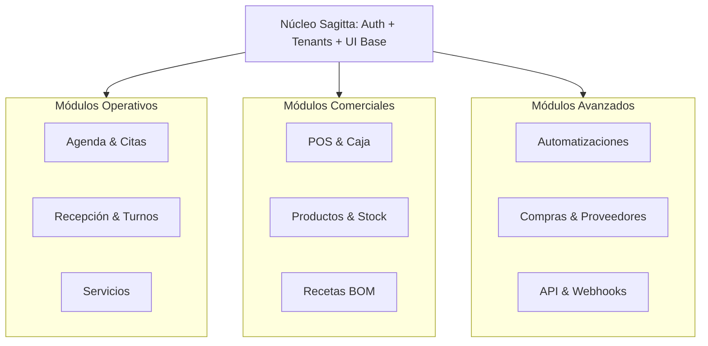

# SAGITTA — MASTER PRODUCT COMPLETENESS & ENTERPRISE UX AUDIT
**Document ID:** `SAGITTA-PCA-2026-V1`  
**Autor:** Principal Product Architect & Senior Frontend Architect  
**Fecha:** Octubre 2026  
**Clasificación:** Confidencial / Estratégico de Producto  
**Estado:** Diagnóstico y Especificación Exhaustiva (Fase Pre-Implementación)

---

## ÍNDICE DE SECCIONES

1. [Executive Summary](#1-executive-summary)
2. [Current Architecture](#2-current-architecture)
3. [Current Capability Map](#3-current-capability-map)
4. [Expanded Capability Map](#4-expanded-capability-map)
5. [Domains](#5-domains)
6. [Modules](#6-modules)
7. [Submodules](#7-submodules)
8. [Capabilities](#8-capabilities)
9. [Variants](#9-variants)
10. [Configurations](#10-configurations)
11. [Add-ons](#11-add-ons)
12. [Automations](#12-automations)
13. [Integrations](#13-integrations)
14. [Workflows](#14-workflows)
15. [Pages](#15-pages)
16. [Subpages](#16-subpages)
17. [Tabs](#17-tabs)
18. [Drawers](#18-drawers)
19. [Modals](#19-modals)
20. [Navigation Architecture](#20-navigation-architecture)
21. [Module Dependencies](#21-module-dependencies)
22. [Maturity Matrix](#22-maturity-matrix)
23. [Completeness Matrix](#23-completeness-matrix)
24. [Missing Features](#24-missing-features)
25. [Incomplete Features](#25-incomplete-features)
26. [Simulated Features](#26-simulated-features)
27. [Backend Requirements](#27-backend-requirements)
28. [UX Audit](#28-ux-audit)
29. [UI Audit](#29-ui-audit)
30. [Visual Redesign Requirements](#30-visual-redesign-requirements)
31. [Monolithic Pages](#31-monolithic-pages)
32. [Split Recommendations](#32-split-recommendations)
33. [Merge Recommendations](#33-merge-recommendations)
34. [Remove Recommendations](#34-remove-recommendations)
35. [Configuration Recommendations](#35-configuration-recommendations)
36. [Modularization Strategy](#36-modularization-strategy)
37. [Plan/Edition Strategy](#37-planedition-strategy)
38. [P0/P1/P2/P3/P4 Priorities](#38-p0p1p2p3p4-priorities)
39. [Roadmap](#39-roadmap)
40. [Acceptance Criteria](#40-acceptance-criteria)
41. [Risks](#41-risks)
42. [Final Recommendation](#42-final-recommendation)

---

## 1. EXECUTIVE SUMMARY

Sagitta es una plataforma de software concebida con una visión empresarial ambiciosa: **"Sagitta se adapta al negocio, no el negocio a Sagitta"**. Actualmente cuenta con un frontend moderno desarrollado en React 18, TypeScript, Tailwind CSS, empaquetado como Progressive Web App (PWA) con soporte fuera de línea (`LocalStorageAdapter`), emulación de APIs mediante MSW (`Mock Service Worker`) y una arquitectura base con repositorios desacoplados (`I*Repository`).

Tras una expansión funcional previa que incorporó conceptos de Punto de Venta (POS), Hardware Térmico ESC/POS, Kardex de Inventario, Recetas de Consumo (BOM), Cola Walk-in, y Motor de Reglas de Automatización, la plataforma exhibe una paradoja clásica de crecimiento acelerado:

1. **Amplitud horizontal aparente alta:** Existen 22 rutas, 140+ interfaces de datos y 12 preajustes de industria (`INDUSTRY_PRESETS`).
2. **Profundidad vertical y desacoplamiento de UX deficientes:** Las funcionalidades críticas están comprimidas en páginas monolíticas gigantescas (como `PortalReservaPage` con 1,877 líneas, `ConfiguracionPage` con 1,392 líneas, `VentasPage` con 1,382 líneas e `InventarioPage` con 1,066 líneas).
3. **Falsa sensación de completitud:** Varias funcionalidades críticas (como sincronización con CRMs externos, webhooks, campañas de marketing, planes de fidelización o compras a proveedores) existen solo a nivel de interfaz de usuario o simulación en memoria (`SIMULATED` / `UI_ONLY`), sin persistencia transaccional multiusuario ni infraestructura de backend lista para producción (`BACKEND_REQUIRED`).
4. **Colisión de dominios de información:** Rutas como `/crm` no albergan un CRM para gestión de prospectos y clientes, sino una consola técnica para desarrolladores (API keys y visor OpenAPI); `/finanzas` mezcla cobros con marketing (gift cards y promociones) y con nómina (comisiones de empleados).

Este documento establece el diagnóstico exhaustivo y la especificación de producto requerida para transformar Sagitta en una plataforma modular empresarial real, escalable a través de 8 niveles de descomposición jerárquica y lista para operar en entornos multi-sucursal y multi-industria.

---

## 2. CURRENT ARCHITECTURE

### 2.1 Stack Tecnológico
- **Frontend Core:** React 18.3.1, TypeScript 5.5, Vite 6.4.3.
- **Enrutamiento:** `react-router-dom` v6 con rutas perezosas (`React.lazy` + `Suspense`).
- **Diseño y Estilos:** Tailwind CSS v3, Lucide React (iconografía), sistema de tokens CSS dinámicos (variables CSS inyectadas por `themeEngine.ts`).
- **Estado Global:** Context API (`TenantContext`, `ModulesContext`, `I18nContext`, `ConfiguracionContext`, `AppContext`, `AuthContext`, `ReservaContext`).
- **Almacenamiento y Capa de Datos:**
  - Modo local: `LocalStorageAdapter` con colecciones serializadas en JSON.
  - Modo API: `apiClient` con cabeceras `Authorization: Bearer <token>` y `X-Tenant-ID`.
  - Capa de Repositorios: Patrón Repository con conmutación dinámica (`VITE_DATA_MODE=local|api`).
- **PWA & Offline:** `vite-plugin-pwa` con `Workbox` (generación automática de Service Worker y manifiesto).
- **Control de Calidad:** ESLint 9 (flat config), Vitest para pruebas unitarias.

### 2.2 Diagnóstico de la Arquitectura Actual
- **Fortalezas:** El desacoplamiento en la capa de repositorios (`IAppointmentRepository`, `IClientRepository`, `ISalesRepository`, etc.) permite alternar entre desarrollo local y backend sin refactorizar los componentes de presentación. Los tipos de TypeScript están unificados y son estrictos.
- **Debilidades:**
  - Todos los modelos de datos de la plataforma residen en un único archivo monolítico (`src/types.ts`, 1,477 líneas y 37.9 KB).
  - El contexto `ConfiguracionContext` mezcla ajustes visuales de marca blanca, datos fiscales del negocio, parámetros de hardware de impresión y estado de temas.
  - No existe un motor formal de caché o estado del lado del servidor (como TanStack Query); cada página orquesta `Promise.all` manuales con efectos secundarios (`useEffect`) repetitivos.

---

## 3. CURRENT CAPABILITY MAP

A continuación se resume el estado de las capacidades declaradas actualmente en el registro de módulos (`src/config/modules.ts`):

```text
INICIO
 └── Dashboard: KPIs del día [MOCK], Próximas citas [LOCAL], Accesos rápidos [REAL]

OPERACIONES
 ├── Citas: Vistas mes/semana/lista [REAL], Wizard de reserva [REAL], Cancelación/Facturación [REAL], Colisión de horario/recurso [REAL]
 ├── Recepción: Cola Walk-in [REAL], Lista de espera [REAL]
 ├── Servicios: Catálogo [REAL], Categorías/Buffers [REAL], Paquetes [REAL], Membresías [REAL], Recetas/BOM [PARCIAL]
 ├── Profesionales: Directorio [REAL], Jornadas [REAL], Comisiones [PARCIAL]
 └── Recursos: Salas/Cabinas [REAL], Bloqueos de agenda [REAL]

CLIENTES
 ├── Directorio: Expediente 360° [REAL], Notas [REAL], Archivos [REAL], Consentimientos [REAL], Tags [REAL]
 ├── CRM Comercial: Pipeline/Oportunidades [MISSING - solo conector externo]
 ├── Fidelización: Puntos/Recompensas [MISSING]
 └── Portal del Cliente: Autoservicio de citas/compras [SIMULATED en PortalReservaPage]

VENTAS
 ├── POS: Carrito comercial [REAL], Split payment [REAL], Sesión/Arqueo de caja [REAL], Ticket ESC/POS [REAL]
 ├── Facturación: Facturas [REAL], Cupones [REAL], Reembolsos [REAL]
 └── Hardware: Web Bluetooth [REAL], Cajón de dinero [REAL], Escáner código de barras [REAL]

INVENTARIO
 ├── Existencias: Kardex/Movimientos [REAL], Alertas de stock [REAL]
 └── Compras: Proveedores [PARCIAL], Órdenes de compra [PARCIAL]

MARKETING & AUTOMATIZACIONES
 ├── Automatizaciones: Motor Trigger/Action [REAL-LOCAL], Plantillas [REAL], Bitácora [REAL]
 └── Campañas: Segmentación dinámica y envíos masivos [MISSING]

CONFIGURACIÓN & DESARROLLADORES
 ├── Usuarios & Roles: RBAC básico [REAL], Matriz de permisos [PARCIAL]
 ├── Módulos: Selector de industria y activación con dependencias [REAL]
 ├── Integraciones: ICS Calendar [REAL], Webhooks [SIMULATED], WhatsApp [SIMULATED]
 ├── Desarrolladores: API keys [REAL-LOCAL], OpenAPI Viewer [REAL], Auditoría [REAL-LOCAL]
 └── Ajustes: Marca blanca [REAL], Widget de reservas [REAL]
```

---

## 4. EXPANDED CAPABILITY MAP

Para que Sagitta sea una plataforma empresarial multi-industria escalable, la descomposición debe expandirse a través de los 10 niveles jerárquicos:

```text
DOMINIO (Domain)
 └── MÓDULO (Module)
      └── SUBMÓDULO (Submodule)
           └── CAPACIDAD (Capability)
                └── VARIANTE (Variant)
                     └── CONFIGURACIÓN (Configuration)
                          └── ADD-ON (Add-on)
                               └── AUTOMATIZACIÓN (Automation)
                                    └── INTEGRACIÓN (Integration)
                                         └── FLUJO (Workflow)
                                              └── SUPERFICIE UX (UI Surface: Page/Tab/Drawer/Modal)
```

A continuación se detalla el desglose expandido por cada uno de los dominios funcionales.

---

## 5. DOMAINS

Sagitta se estructura en **8 Grandes Dominios Empresariales**:

1. **DOM-01: Core Platform & Enterprise Governance** (Tenants, Organizaciones, Sucursales, RBAC, Seguridad, White-label).
2. **DOM-02: Clientes & CRM 360°** (Directorio B2C/B2B, Expediente Clínico/Técnico, Segmentos, Consentimientos, Fidelización).
3. **DOM-03: Agenda & Planificación Operativa** (Calendarios, Citas, Disponibilidad, Recursos Físicos, Cola Walk-in, Espera).
4. **DOM-04: Catálogo Comercial Unificado** (Servicios, Productos Físicos, Kits/Bundles, Membresías Recurrentes, Recetas BOM).
5. **DOM-05: Inventario, Logística & Cadena de Suministro** (Multi-almacén, Kardex, Lotes/Vencimientos, Conteos, Compras, Reabastecimiento).
6. **DOM-06: POS, Ventas & Comercio Omnicanal** (Terminal Táctil, Carrito, Pagos Mixtos, Caja/Arqueo, Hardware ESC/POS, Comisiones).
7. **DOM-07: Automatización, Comunicaciones & Marketing** (Motor Trigger-Condition-Action, Plantillas, WhatsApp/Email/SMS, Campañas).
8. **DOM-08: Analítica, Portales & Conectividad Externa** (Business Intelligence, Portal Autoservicio, Portal Público, API & Webhooks).

---

## 6. MODULES

| ID Módulo | Dominio | Nombre Comercial | Responsabilidad Primaria |
| :--- | :--- | :--- | :--- |
| `MOD-TENANT` | DOM-01 | Gobierno Multi-Tenant & Sedes | Organización multi-empresa y multi-sucursal con aislamiento estricto. |
| `MOD-AUTH` | DOM-01 | Identidad, Usuarios & RBAC | Cuentas de acceso, autenticación de dos factores (2FA), roles y permisos granulares. |
| `MOD-BRAND` | DOM-01 | Marca Blanca & Localización | Apariencia corporativa, dominios personalizados, monedas, idiomas y zonas horarias. |
| `MOD-CRM` | DOM-02 | Clientes & Expediente 360° | Ficha unificada, historial comercial, notas de evolución y consentimientos. |
| `MOD-LOYAL` | DOM-02 | Fidelización & Recompensas | Puntos por consumo, niveles de membresía (tiering) y programa de referidos. |
| `MOD-AGENDA` | DOM-03 | Agenda & Calendario | Planificación de citas por especialista, cabina y sede con detección de colisiones. |
| `MOD-DESK` | DOM-03 | Recepción & Turnos Walk-in | Gestión de mostrador, turnos espontáneos por orden de llegada y lista de espera. |
| `MOD-CATAL` | DOM-04 | Catálogo de Servicios & Extras | Menú de tratamientos/servicios, duraciones, extras y paquetes de sesiones. |
| `MOD-PRODS` | DOM-04 | Catálogo de Productos & Kits | Artículos para la venta y consumo interno, SKU, códigos de barras y variantes. |
| `MOD-BOM` | DOM-04 | Recetas de Insumos (BOM) | Costeo de servicios por insumo utilizado y descuento automático de stock. |
| `MOD-STOCK` | DOM-05 | Inventario & Kardex | Existencias por almacén, transferencias, ajustes de merma y trazabilidad. |
| `MOD-PURCH` | DOM-05 | Compras & Proveedores | Directorio de proveedores, órdenes de compra y recepción de mercancía. |
| `MOD-POS` | DOM-06 | Punto de Venta (POS) | Terminal de cobro de alta velocidad, propinas, descuentos y facturación. |
| `MOD-CASH` | DOM-06 | Gestión de Caja & Arqueo | Apertura, movimientos de entrada/salida, cierre ciego y auditoría de efectivo. |
| `MOD-HARDW` | DOM-06 | Hardware & Periféricos | Impresoras térmicas (58/80mm Bluetooth/USB), cajón portamonedas y lectores. |
| `MOD-PAYM` | DOM-06 | Facturación & Finanzas | Facturas vinculadas, notas de crédito, cupones de descuento y reembolsos. |
| `MOD-COMM` | DOM-06 | Nómina & Comisiones | Liquidación de comisiones fijas y porcentuales por profesional o ítem. |
| `MOD-AUTO` | DOM-07 | Motor de Automatizaciones | Reglas declarativas basadas en eventos para flujos desatendidos. |
| `MOD-MESS` | DOM-07 | Comunicaciones & Mensajería | Envíos transaccionales por WhatsApp, Email y SMS con plantillas dinámicas. |
| `MOD-REP` | DOM-08 | Inteligencia & Reportes | Dashboards analíticos de ingresos, retención, no-shows y rentabilidad. |
| `MOD-PORTAL` | DOM-08 | Portales Públicos & Widget | Reservas online autoservicio, agenda embebible y catálogo digital. |
| `MOD-DEV` | DOM-08 | API & Desarrolladores | Claves de API, webhooks salientes, registros de auditoría y documentación OpenAPI. |

---

## 7. SUBMODULES

Desglose de submódulos por módulo operativo:

- **`MOD-TENANT`:**
  - `SUB-TEN-01: Jerarquía Organizacional` (Organización madre ➔ Empresas ➔ Sucursales).
  - `SUB-TEN-02: Configuración Regional por Sede` (Moneda, huso horario, impuestos locales).
- **`MOD-AUTH`:**
  - `SUB-AUT-01: Usuarios de Sistema` (Credenciales, estados, asignación de sede).
  - `SUB-AUT-02: Matriz de Roles & Permisos` (Permisos CRUD por módulo y acción).
- **`MOD-CRM`:**
  - `SUB-CRM-01: Directorio & Contactos` (B2C individual y B2B empresas).
  - `SUB-CRM-02: Expediente 360°` (Resumen comercial, citas, compras, saldo de bonos).
  - `SUB-CRM-03: Ficha Técnica & Consentimientos` (Notas clínicas, fotos antes/después, firmas).
  - `SUB-CRM-04: Segmentación & Etiquetas` (VIP, inactivos, recurrencia, filtros dinámicos).
- **`MOD-AGENDA`:**
  - `SUB-AGE-01: Calendario Multivista` (Vistas de día, semana, mes y profesional).
  - `SUB-AGE-02: Motor de Disponibilidad` (Horarios laborales, pausas, excepciones, buffers).
  - `SUB-AGE-03: Asignación de Recursos Físicos` (Cabinas, salas, sillones y aparatología).
  - `SUB-AGE-04: Gestión de Excepciones` (Bloqueos por mantenimiento, feriados, capacitaciones).
- **`MOD-STOCK`:**
  - `SUB-STK-01: Existencias Multi-Almacén` (Stock por ubicación física y estantería).
  - `SUB-STK-02: Kardex de Movimientos` (Trazabilidad detallada por tipo de operación y costo).
  - `SUB-STK-03: Lotes & Vencimientos` (Fecha de caducidad y número de lote para insumos).
  - `SUB-STK-04: Conteos Físicos & Ajustes` (Auditorías de inventario cíclicas y conciliación).
- **`MOD-POS`:**
  - `SUB-POS-01: Terminal de Venta Táctil` (Búsqueda rápida, escáner de código de barras, teclado rápido).
  - `SUB-POS-02: Pasarela de Cobro Mixto` (Split payment, propinas, gift cards, monedero).
  - `SUB-POS-03: Sesiones de Caja` (Turnos de operario, arqueos de apertura/cierre y diferencias).

---

## 8. CAPABILITIES

Clasificación exhaustiva de capacidades principales según la regla de completitud:

| Código | Capacidad | Dominio | Clasificación | Justificación de Estado |
| :--- | :--- | :--- | :--- | :--- |
| `CAP-001` | Multi-Tenant Data Isolation | DOM-01 | **EXISTING** | `X-Tenant-ID` implementado en `TenantContext` y `apiClient`. |
| `CAP-002` | Permisos por Acción Granular | DOM-01 | **PARCIAL** | La UI tiene la matriz en `RolesPage`, pero faltan guards en subpáginas secundarias. |
| `CAP-003` | White-Label Theme Engine | DOM-01 | **EXISTING** | Paletas, tipografías, border-radius y sombras se inyectan dinámicamente. |
| `CAP-004` | Expediente 360° Modular | DOM-02 | **EXISTING** | Refactorizado en `FichaCliente360` con 7 pestañas independientes. |
| `CAP-005` | Segmentos Dinámicos de Clientes | DOM-02 | **UI_ONLY** | Filtro por tags en `ClientesPage`, pero no hay constructor de reglas de segmentación. |
| `CAP-006` | Detección de Colisión de Citas | DOM-03 | **EXISTING** | Valida tanto choque de especialista como de recurso físico en el repositorio. |
| `CAP-007` | Reservas Grupales / Clases | DOM-03 | **MISSING** | La estructura solo maneja citas 1:1; no hay soporte para cupos múltiples. |
| `CAP-008` | Lista de Espera Inteligente | DOM-03 | **PARCIAL** | Permite registrar turnos en espera, pero no notifica automáticamente al liberarse un hueco. |
| `CAP-009` | Descuento Automático de Stock (POS) | DOM-05 | **EXISTING** | `commerceEngine.service.ts` rebaja existencias inmediatamente tras la venta. |
| `CAP-010` | Consumo de Insumos por Servicio (BOM)| DOM-04 | **EXISTING** | `recetasService` y `commerceEngine` calculan y descuentan insumos por servicio completado. |
| `CAP-011` | Gestión de Lotes y Vencimientos | DOM-05 | **MISSING** | No existe entidad `Lote` en `types.ts` ni en los formularios de recepción. |
| `CAP-012` | Múltiples Almacenes por Sucursal | DOM-05 | **MISSING** | El stock está modelado como una cifra plana `stock_actual` sin desglose de bodega/estante. |
| `CAP-013` | Órdenes de Compra a Proveedores | DOM-05 | **PARCIAL** | `GestionProveedoresCompras.tsx` tiene UI y servicio mock, pero no recepción parcial. |
| `CAP-014` | Impresión Térmica Web Bluetooth | DOM-06 | **EXISTING** | Soporte para comandos ESC/POS de 58mm y 80mm en `escposHelper.ts`. |
| `CAP-015` | Arqueo Ciego de Caja | DOM-06 | **PARCIAL** | Existe apertura y cierre de caja, pero muestra el monto esperado antes de que el cajero cuente. |
| `CAP-016` | Motor de Reglas Trigger/Action | DOM-07 | **SIMULATED** | `automationEngine.service.ts` ejecuta reglas en memoria/localStorage; requiere daemon backend. |
| `CAP-017` | Integración Oficial WhatsApp API | DOM-07 | **SIMULATED** | Abre `wa.me/?text=` o simula webhook; no conecta a Cloud API / Twilio real. |
| `CAP-018` | Generación de API Keys Seguras | DOM-08 | **SIMULATED** | Las claves se almacenan en LocalStorage sin hash criptográfico en servidor. |

---

## 9. VARIANTS

Capacidades que admiten modalidades diferenciadas según el tipo de empresa:

1. **Modalidades de POS:**
   - *POS Rápido / Retail:* Prioridad de escaneo por código de barras (`#PRD`) y teclado numérico.
   - *POS Servicios / Estética:* Prioridad de selección visual de profesional, duración y propina.
   - *POS Kiosco / Autoservicio:* Pantalla simplificada táctil para pago autónomo por cliente.
2. **Modalidades de Agenda:**
   - *Agenda por Profesional:* Vista en columnas donde cada profesional es una pista temporal.
   - *Agenda por Recurso:* Vista en columnas donde cada cabina/sillón/máquina es una pista.
   - *Agenda de Sede Consolidada:* Vista consolidada para gerentes de zona.
3. **Modalidades de Clientes:**
   - *Ficha Persona Natural (B2C):* Nombre, cédula/DNI, fecha de nacimiento, canal WhatsApp.
   - *Ficha Corporativa (B2B):* Razón social, RIF/NIT/RUT, contacto de compras, facturación a crédito.

---

## 10. CONFIGURATIONS

Las configuraciones deben desacoplarse del código fuente y organizarse por niveles de alcance:

- **Configuración Global de Sistema (Platform):**
  - Módulos maestros activables en la plataforma.
  - Planes y límites de uso (`starter`, `pro`, `enterprise`).
- **Configuración por Tenant (Organización):**
  - Branding: Logotipo claro/oscuro, favicon, colores de marca, tipografía oficial.
  - Datos fiscales: Razón social, ID fiscal, dirección legal, teléfono corporativo.
  - Formato: Moneda primaria (`$`, `€`, `Bs`, `R$`), formato de fecha (`DD/MM/YYYY`), huso horario.
- **Configuración por Sede (Sucursal):**
  - Horario operativo de apertura y cierre.
  - Almacén principal asociado.
  - Periféricos de caja asignados (impresora térmica local, IP de gaveta).
- **Configuración por Usuario:**
  - Tema visual preferido (claro, oscuro, sistema).
  - Sede asignada por defecto.

---

## 11. ADD-ONS

El registro de módulos define complementos opcionales que el negocio puede encender o apagar sin afectar el núcleo:

| Módulo Padre | Clave del Add-on | Nombre del Complemento | Estado en Código |
| :--- | :--- | :--- | :--- |
| `reservas` | `reservas.reprogramacion` | Reprogramación Asistida de Citas | **EXISTING** |
| `reservas` | `reservas.grupales` | Clases y Citas Grupales con Cupo | **MISSING** |
| `recepcion` | `recepcion.walk_in` | Cola de Turnos Espontáneos | **EXISTING** |
| `recepcion` | `recepcion.lista_espera` | Lista de Espera para Huecos Libres | **EXISTING** |
| `servicios` | `servicios.paquetes` | Bonos prepagados de N sesiones | **EXISTING** |
| `servicios` | `servicios.membresias` | Suscripciones Recurrentes periódicas | **EXISTING** |
| `servicios` | `servicios.recetas` | Insumos por Servicio (BOM) | **EXISTING** |
| `profesionales`| `profesionales.comisiones` | Liquidación de Comisiones | **PARCIAL** |
| `pos` | `pos.gift_cards` | Emisión y Saldo de Gift Cards | **EXISTING** |
| `pos` | `pos.promociones` | Reglas de Descuento Automáticas | **EXISTING** |
| `pos` | `pos.devoluciones` | Reintegro y Devolución a Caja | **EXISTING** |
| `inventario` | `inventario.lotes` | Trazabilidad por Lote y Caducidad | **MISSING** |
| `inventario` | `inventario.almacenes` | Múltiples Bodegas por Sucursal | **MISSING** |

---

## 12. AUTOMATIONS

El motor de automatización está modelado bajo la arquitectura:

$$\text{Trigger} \longrightarrow \text{Condiciones} \longrightarrow \text{Acciones} \longrightarrow \text{Delays/Ramas}$$

### 12.1 Triggers Identificados en Negocio
1. `reserva_creada`: Nueva cita confirmada por cliente o recepcionista.
2. `reserva_cancelada`: Cita cancelada (requiere liberación de agenda y notificación).
3. `reserva_completada`: Servicio prestado (dispara consumo BOM, factura y encuesta).
4. `recordatorio_pendiente`: Cita programada dentro de $N$ horas (prevención de no-show).
5. `stock_minimo_alcanzado`: Artículo con existencias inferiores al umbral seguro.
6. `cliente_cumpleanos`: Fecha de cumpleaños del cliente.
7. `cliente_inactivo`: Cliente sin citas ni compras en los últimos 45/60/90 días.
8. `pago_registrado`: Cobro procesado en POS (envío de recibo digital).

### 12.2 Estructura de Ejecución Requerida
- Actualmente, `automationEngine.service.ts` ejecuta los triggers en el navegador de manera síncrona o al cargar la página.
- **Requerimiento Crítico de Backend:** Las automatizaciones basadas en tiempo (como recordatorios 24h antes o alertas de cumpleaños) **no pueden depender de que un navegador esté abierto**. Requieren un cron job o cola de tareas (`Celery`, `BullMQ`, `Temporal` o `Cloud Tasks`) en el servidor.

---

## 13. INTEGRATIONS

Evaluación objetiva del ecosistema de integraciones:

| Categoría | Servicio Externo | Estado Real | Nivel de Madurez | Observación Técnica |
| :--- | :--- | :--- | :---: | :--- |
| Calendarios | Google Calendar | **PARCIAL** | 3/5 | Genera deep-link de inserción web y exporta `.ics`. Falta sincronización bidireccional OAuth. |
| Videollamada| Google Meet / Zoom | **SIMULATED** | 2/5 | Genera links estáticos en la URL de la cita; no provisiona salas mediante API. |
| Mensajería | WhatsApp Business | **SIMULATED** | 2/5 | Utiliza esquema `https://wa.me/` con texto preformateado. Requiere Webhooks y Cloud API oficial. |
| Mensajería | Correo Electrónico (SMTP)| **SIMULATED** | 2/5 | Simula el envío y registra el log en LocalStorage; requiere SendGrid/Postmark/SES. |
| Pagos | Tarjeta / POS Físico | **EXISTING** | 4/5 | Registro manual de lote/tarjeta en el POS. |
| Pagos Online| Stripe / Checkout | **UI_ONLY** | 2/5 | Existe opción en radio button; no carga Stripe Elements ni procesa tokens bancarios. |
| CRM Externo | HubSpot / Salesforce | **SIMULATED** | 2/5 | Pantalla con toggle de conexión y botón de "Sincronizar" con retardo artificial (`setTimeout`). |
| Webhooks | Endpoints de Terceros | **PARCIAL** | 3/5 | Permite registrar URL y secreto HMAC en UI; el disparo se simula localmente. |

---

## 14. WORKFLOWS

Flujos de trabajo transversales esenciales que deben ser soportados de punta a punta:

### 14.1 Flujo Operativo: "Atención de Cita ➔ Consumo ➔ Cobro ➔ Comisión"


### 14.2 Flujo de Mostrador: "Walk-in Espontáneo ➔ Asignación de Turno"
1. Cliente sin cita entra al negocio.
2. Recepcionista abre `Recepción ➔ Cola Walk-in`.
3. Registra nombre, servicio deseado y selecciona "Cualquier especialista disponible" o uno preferido.
4. El sistema calcula el tiempo de espera estimado y asigna un número de turno consecutivo.
5. Cuando el especialista se desocupa, el turno pasa a "Llamado" y luego a "En Atención".

---

## 15. PAGES

Propuesta de páginas raíz de primer nivel (navegación mayor):

1. `/dashboard`: Centro de control ejecutivo y resumen de la jornada.
2. `/operaciones`: Centro de agenda, citas, turnos walk-in y recursos.
3. `/clientes`: Directorio integral de clientes, fichas 360 y CRM.
4. `/catalogo`: Catálogo unificado de servicios, productos, membresías y recetas.
5. `/inventario`: Control de existencias, almacenes, movimientos y compras.
6. `/ventas`: Terminal POS de alta velocidad, historial de transacciones y caja.
7. `/marketing`: Campañas, promociones, fidelización y automatizaciones.
8. `/analitica`: Inteligencia de negocio, métricas financieras y operativas.
9. `/configuracion`: Administración del sistema, roles, sedes, marca blanca e integraciones.

---

## 16. SUBPAGES

Descomposición de submódulos en páginas con URL propia e historial de navegación independiente:

- **Bajo `/operaciones`:**
  - `/operaciones/agenda`: Calendario general interactivo.
  - `/operaciones/recepcion`: Tablero Kanban de turnos walk-in y lista de espera.
  - `/operaciones/recursos`: Listado de salas, cabinas, sillones y bloqueos.
  - `/operaciones/profesionales`: Gestión de personal, horarios y turnos de trabajo.
- **Bajo `/catalogo`:**
  - `/catalogo/servicios`: Lista de servicios, tiempos, precios y extras.
  - `/catalogo/productos`: Catálogo comercial de artículos vendibles.
  - `/catalogo/membresias`: Planes recurrentes y bonos de sesiones.
  - `/catalogo/recetas`: Fichas técnicas de consumo de insumos (BOM).
- **Bajo `/inventario`:**
  - `/inventario/stock`: Existencias actuales por almacén y alertas.
  - `/inventario/kardex`: Auditoría histórica de entradas, salidas y mermas.
  - `/inventario/conteos`: Auditorías físicas y conciliación de diferencias.
  - `/inventario/compras`: Proveedores y órdenes de abastecimiento.
- **Bajo `/ventas`:**
  - `/ventas/pos`: Pantalla táctil de cobro.
  - `/ventas/historial`: Registro cronológico de facturas y ventas.
  - `/ventas/caja`: Control de turnos de efectivo, arqueos y movimientos de caja.
  - `/ventas/hardware`: Diagnóstico y enlace de impresoras térmicas ESC/POS.
- **Bajo `/configuracion`:**
  - `/configuracion/empresa`: Perfil corporativo, datos fiscales y sedes.
  - `/configuracion/marca`: Motor de apariencia, logotipos, temas y widgets.
  - `/configuracion/usuarios`: Directorio de cuentas y credenciales.
  - `/configuracion/roles`: Matriz de roles y permisos del sistema.
  - `/configuracion/modulos`: Activador de funciones y selector de industria.
  - `/configuracion/desarrolladores`: API Keys, Webhooks, visor OpenAPI y logs.

---

## 17. TABS

Uso de pestañas para alternar vistas estrechamente relacionadas que comparten el mismo contexto de página:

1. **En `/clientes/ficha/:id` (Expediente 360°):**
   - Tab 1: Identidad & Datos de Contacto.
   - Tab 2: Historial de Citas y Atenciones.
   - Tab 3: Saldo de Paquetes & Membresías Activas.
   - Tab 4: Bitácora de Notas Técnicas.
   - Tab 5: Archivos y Documentación Adjunta.
   - Tab 6: Consentimientos Informados y Firmas.
   - Tab 7: Campos Dinámicos de la Vertical.
2. **En `/operaciones/agenda`:**
   - Tab de vista: Mes | Semana | Día | Lista de Citas.
3. **En `/ventas/caja`:**
   - Tab 1: Turno Actual (Estado de caja abierta/cerrada).
   - Tab 2: Historial de Arqueos y Cierres Anteriores.
   - Tab 3: Movimientos de Efectivo (Ingresos / Retiros manuales).

---

## 18. DRAWERS (Paneles Laterales Deslizables)

Superficies ideales para edición contextual rápida sin perder de vista la tabla o listado principal:

1. **Drawer de Detalle de Cita:** Al hacer clic en un bloque del calendario, despliega un panel lateral derecho con el cliente, profesional, servicios contratados, notas y botones de acción rápida (*Iniciar atención*, *Completar*, *Reprogramar*, *Cobrar en POS*).
2. **Drawer de Detalle de Venta:** Muestra el desglose de ítems, cálculo de comisiones, pagos mixtos y opción de reimpresión de ticket térmico.
3. **Drawer de Filtros Avanzados:** En tablas densas (como Clientes o Kardex), abre un drawer lateral para configurar filtros complejos por fechas, rangos de importe, sedes y etiquetas.

---

## 19. MODALS

Superficies reservadas exclusivamente para confirmaciones críticas, flujos lineales cortos o entradas focalizadas:

1. **Modal de Cobro POS (`ModalCobroPOS`):** Selección del método de pago, desglose split, cálculo de cambio y confirmación.
2. **Modal de Apertura / Cierre de Caja:** Ingreso del monto base de caja o recuento ciego de billetes al finalizar el turno.
3. **Modal de Confirmación de Reprogramación / Cancelación:** Advertencia sobre penalizaciones por no-show o conflicto de disponibilidad.
4. **Modal de Nuevo Cliente Rápido:** Formulario ágil para crear un contacto en menos de 20 segundos sin salir de la agenda o del POS.

---

## 20. NAVIGATION ARCHITECTURE

Propuesta de arquitectura de navegación para la barra lateral (`Sidebar.tsx`), organizada en grupos lógicos orientados a la operación empresarial:

```text
[ SEDE ACTIVA: Sucursal Principal ▼ ]

OPERACIONES
  ├── 📅 Agenda
  ├── 🛎️ Recepción & Walk-in
  ├── 🚪 Recursos & Cabinas
  └── 👥 Profesionales & Horarios

COMERCIAL & CAJA
  ├── 🛒 Terminal POS
  ├── 🧾 Ventas & Facturas
  ├── 💵 Caja & Arqueo
  └── 🖨️ Hardware & Impresoras

CATÁLOGO & STOCK
  ├── 🏷️ Servicios & Paquetes
  ├── 📦 Catálogo de Productos
  ├── 📋 Recetas de Insumos (BOM)
  ├── 📊 Kardex de Inventario
  └── 🚚 Compras & Proveedores

RELACIÓN CON CLIENTES
  ├── 👤 Directorio de Clientes
  ├── 🎁 Fidelización & Puntos
  └── ⚡ Automatizaciones & Mensajes

INTELIGENCIA
  └── 📈 Reportes & Indicadores

ADMINISTRACIÓN
  ├── 🏢 Empresa & Sedes
  ├── 🎨 Marca Blanca & Temas
  ├── 🔒 Usuarios & Permisos
  ├── 🧩 Módulos & Industria
  └── 💻 Desarrolladores & API
```

---

## 21. MODULE DEPENDENCIES

Grafo de dependencias técnicas y funcionales entre módulos para prevenir fallos en cascada al desactivar funciones:



- **Regla de Dependencia Técnica:** Si un negocio desactiva el módulo `inventario`, el módulo `pos` debe continuar funcionando, pero desactiva automáticamente las pestañas de productos físicos y el descuento de stock de recetas BOM, operando en modo estrictamente de servicios.
- **Regla de Independencia de Hardware:** El módulo `hardware` es complementario al `pos`. Si falla la conexión Web Bluetooth, el POS debe permitir confirmar la venta normalmente y ofrecer descarga de factura en PDF.

---

## 22. MATURITY MATRIX

Escala de evaluación:  
- **5/5:** Maduro, listo para comercialización enterprise.  
- **4/5:** Sólido, funcional y probado.  
- **3/5:** Funcional pero incompleto (requiere refinamiento).  
- **2/5:** Prototipo / Solo interfaz de usuario.  
- **1/5:** Esqueleto / Placeholder.  
- **0/5:** Inexistente.

| Módulo | Estado | Profundidad | UX | Backend Readiness | Arquitectura | Madurez Global |
| :--- | :---: | :---: | :---: | :---: | :---: | :---: |
| **Clientes & Directorio** | Funcional | 4/5 | 4/5 | Frontend Ready / Local | 4/5 | **4.0 / 5** |
| **Agenda & Citas** | Funcional | 4/5 | 4/5 | Frontend Ready / Local | 4/5 | **4.0 / 5** |
| **Punto de Venta (POS)** | Funcional | 4/5 | 4/5 | Frontend Ready / Local | 3.5/5 | **3.8 / 5** |
| **Hardware ESC/POS** | Funcional | 4/5 | 3.5/5 | Frontend Ready (Web Bluetooth)| 4/5 | **3.8 / 5** |
| **Servicios & Paquetes** | Funcional | 4/5 | 3.5/5 | Frontend Ready / Local | 3.5/5 | **3.7 / 5** |
| **Recepción & Walk-in** | Funcional | 3.5/5 | 3.5/5 | Mock / Simulado | 3.5/5 | **3.5 / 5** |
| **Caja & Arqueo** | Funcional | 3.5/5 | 3.5/5 | Local / Simulado | 3.5/5 | **3.5 / 5** |
| **Inventario & Kardex** | Parcial | 3/5 | 3/5 | Local / Simulado | 3/5 | **3.0 / 5** |
| **Automatizaciones** | Parcial | 3/5 | 3/5 | Backend Required | 3/5 | **3.0 / 5** |
| **Marca Blanca & Temas**| Funcional | 4/5 | 3/5 | Frontend Ready / Local | 3/5 | **3.3 / 5** |
| **Roles & Permisos** | Parcial | 3/5 | 3/5 | Frontend Ready / Local | 3/5 | **3.0 / 5** |
| **Reportes & KPIs** | Parcial | 2.5/5 | 3/5 | Mock / Local | 2.5/5 | **2.6 / 5** |
| **Compras & Proveedores**| Parcial | 2/5 | 2.5/5 | Mock / Local | 2.5/5 | **2.3 / 5** |
| **Integraciones Externas**| Prototipo | 2/5 | 2/5 | Integration Required | 2/5 | **2.0 / 5** |
| **CRM Comercial (Leads)**| Inexistente | 0/5 | 0/5 | Backend Required | 0/5 | **0.0 / 5** |
| **Fidelización / Puntos**| Inexistente | 0/5 | 0/5 | Backend Required | 0/5 | **0.0 / 5** |

---

## 23. COMPLETENESS MATRIX

| Capacidad Específica | ¿Existe? | ¿Completa? | ¿UI Lista? | ¿Backend Listo? | ¿Usa Mock/Local? | Brecha Pendiente | Ubicación Actual | Prioridad |
| :--- | :---: | :---: | :---: | :---: | :---: | :--- | :--- | :---: |
| Buscador Global Omnibar | Sí | Sí | Sí | N/A | No | Ninguna | `Navbar.tsx` (`Ctrl+K`) | P0 |
| Detección Choque Citas | Sí | Sí | Sí | En local | Sí | Validar concurrencia en API | `LocalAppointmentRepository` | P0 |
| Ficha 360 Descompuesta | Sí | Sí | Sí | En local | Sí | Migrar a PostgreSQL | `FichaCliente360.tsx` | P0 |
| POS Carrito & Multi-Pago| Sí | Sí | Sí | En local | Sí | Transacciones ACID | `VentasPage.tsx` | P1 |
| Arqueo Ciego de Caja | Sí | Parcial | Sí | En local | Sí | Ocultar saldo real al cajero | `VentasPage.tsx` | P1 |
| Desglose Multi-Almacén | No | No | No | No | No | Crear modelo y selector | Ninguna (en `InventarioPage`)| P1 |
| Kardex con Costo Promedio| Sí | Parcial | Sí | En local | Sí | Cálculo de valoración FIFO | `InventarioPage.tsx` | P2 |
| Recepción de Compras | Sí | Parcial | Sí | En local | Sí | Recepción parcial de ítems | `GestionProveedoresCompras`| P2 |
| Recetas de Insumos (BOM) | Sí | Sí | Sí | En local | Sí | Mermas dinámicas | `GestionRecetasBOM.tsx` | P1 |
| WhatsApp Cloud API | Sí | No | Sí | No | Sí (wa.me)| Conector oficial webhook | `IntegracionesPage.tsx` | P2 |
| Campañas & Segmentos | No | No | No | No | No | Motor de filtros dinámicos | Ninguna | P3 |
| Pipeline CRM de Leads | No | No | No | No | No | Tablero Kanban comercial | Ninguna (ruta `/crm` es dev)| P3 |
| Programa de Puntos | No | No | No | No | No | Billetera virtual de puntos | Ninguna | P3 |

---

## 24. MISSING FEATURES

Funcionalidades críticas que no existen en el sistema y son indispensables para una plataforma empresarial:

1. **Gestión de Múltiples Almacenes y Ubicaciones Físicas:** No existe la posibilidad de transferir stock entre la "Bodega Central" y el "Gabinete de Cabina 1" o entre sucursales.
2. **Pipeline de Oportunidades y Leads (CRM Comercial):** Sagitta gestiona clientes que ya existen, pero no dispone de un embudo (Lead ➔ Contactado ➔ Cotización ➔ Ganado) para captar nuevos contratos o clientes de alto valor.
3. **Módulo de Fidelización, Niveles y Puntos:** Ausencia de billetera de puntos acumulables por consumo para canje por servicios o productos.
4. **Citas Grupales con Límite de Capacidad:** Clases de yoga, talleres, catas o cursos donde una sesión admite hasta $N$ clientes simultáneos.
5. **Recepción Parcial en Órdenes de Compra:** Cuando un proveedor entrega solo el 50% del pedido, el sistema no permite recepcionar parte y dejar el resto pendiente.
6. **Facturación Electrónica Fiscal Real:** Módulo tributario desacoplado para firma de comprobantes fiscales electrónicos según la normativa de cada país (CFDI, DTE, Factura Electrónica).

---

## 25. INCOMPLETE FEATURES

Funcionalidades que tienen presencia en el código pero carecen de profundidad operativa:

1. **Gestión de Proveedores:** Permite crear proveedores pero no asocia listas de precios pactadas, plazos de crédito (30/60 días) ni catálogo de productos suministrados por cada uno.
2. **Liquidación de Comisiones:** Permite definir reglas y calcular importes en las ventas, pero no tiene la pantalla formal de cierre de nómina para marcar comisiones como "Pagadas" a los profesionales.
3. **Gestión de Ausencias y Vacaciones:** En `EmpleadosPage` se definen horarios semanales fijos, pero no se pueden agendar vacaciones futuras o bajas médicas que bloqueen la agenda con antelación.
4. **Métricas en Reportes:** Los gráficos en `ReportesPage` calculan métricas estáticas basadas en las facturas existentes, pero carecen de comparativas temporales mes a mes, desglose de márgenes brutos o exportación a hojas de cálculo reales.

---

## 26. SIMULATED FEATURES

Funcionalidades que aparentan funcionar pero operan puramente sobre simuladores o datos locales volátiles:

1. **Conectores de CRM (HubSpot, Salesforce, Pipedrive):** Simulan la sincronización con un temporizador `setTimeout` y retornan un conteo falso de registros sincronizados.
2. **Webhooks Salientes:** La UI permite registrar endpoints y simular pruebas, pero no existe un worker con reintentos exponenciales ni firma HMAC en servidor.
3. **Comunicaciones Transaccionales:** El envío de correos y SMS registra un registro en la tabla local de logs sin conectarse a pasarelas reales.
4. **Portal del Cliente:** `PortalReservaPage` simula ser el portal público, pero el cliente final no tiene un login real donde consultar sus facturas o cancelar sus citas sin contactar al negocio.

---

## 27. BACKEND REQUIREMENTS

Para llevar Sagitta a un estándar comercial enterprise, el backend debe proporcionar:

1. **Transaccionalidad ACID:**
   - La operación de venta en POS debe ejecutarse dentro de una transacción única en base de datos: si falla el registro del pago, debe revertirse el descuento de stock y el cálculo de comisiones.
2. **Aislamiento Multi-Tenant en Base de Datos:**
   - Uso de esquemas de PostgreSQL (`schema-per-tenant`) o políticas de seguridad a nivel de fila (`Row-Level Security - RLS`) basadas en `tenant_id`.
3. **Motor Asíncrono de Tareas y Cron Jobs:**
   - Un worker (`BullMQ` con Redis o similar) para procesar disparadores temporales (recordatorios de cita 24h/2h antes, cobros recurrentes de membresías, alertas de vencimiento de stock).
4. **Almacenamiento Seguro de Credenciales:**
   - Hashing con `bcrypt`/`argon2` para contraseñas de usuarios y almacenamiento cifrado (`AES-256-GCM`) para tokens de integración de WhatsApp y llaves de Stripe.
5. **Almacenamiento de Archivos Digitales:**
   - Subida de archivos y consentimientos a buckets compatibles con S3 / Cloud Storage mediante URLs prefirmadas.

---

## 28. UX AUDIT

Evaluación de la experiencia de usuario (UX) recorriendo el producto:

### 28.1 Hallazgos Críticos
- **Orientación del Usuario:** En páginas extensas como `InventarioPage` o `VentasPage`, el usuario pierde el contexto de en qué submódulo se encuentra debido a que las pestañas están anidadas sin reflejo en la URL (al recargar la página, se pierde la pestaña seleccionada).
- **Sobrecarga Cognitiva:** `ConfiguracionPage` muestra decenas de controles de diseño, selectores de tipografía, configuración de radio de esquinas y formularios fiscales en una sola vista interminable.
- **Ambigüedad de Rutas:** La ruta `/crm` conduce a una pantalla técnica de desarrolladores con documentación OpenAPI y API keys, lo cual desorienta a los usuarios de negocio que buscan gestión de clientes.
- **Feedback de Acciones:** La mayoría de las mutaciones utilizan `toast.success`, lo cual es positivo, pero faltan estados de carga intermedios en botones de acción dentro de modales complejos.

---

## 29. UI AUDIT

Evaluación visual y estética:

### 29.1 Erradicación de la Estética "Genérica de IA"
- **Evitar:** Se deben evitar por completo gradientes morados/púrpuras estridentes, tarjetas flotantes con sombras desmedidas (`shadow-2xl`), efectos de cristal translúcido (*glassmorphism*) excesivos y bordes demasiado redondeados (`rounded-3xl` en elementos pequeños).
- **Consistencia Visual:** La interfaz debe proyectar sobriedad técnica de software empresarial (tonos pizarra, grises neutros de zinc, contrastes WCAG AA claros, tipografía nítida y jerarquías tipográficas controladas).

### 29.2 Sistema de Componentes
- La librería en `src/components/ui/` cuenta con componentes base sólidos (`Button`, `Badge`, `Modal`, `Input`, `Select`, `Table`, `Tabs`, `Pagination`).
- **Problema:** En varias páginas complejas (`VentasPage`, `InventarioPage`), los desarrolladores recurrieron a inputs y botones HTML nativos estilizados inline con Tailwind en lugar de utilizar los componentes centralizados de `src/components/ui`, provocando pequeñas inconsistencias en paddings y focus rings.

---

## 30. VISUAL REDESIGN REQUIREMENTS

Para alcanzar un nivel de madurez visual 10/10:

1. **Formalización del Sistema de Design Tokens:**
   - Centralizar todas las escalas de espaciado, alturas de fila de tabla, radios de esquina y elevaciones en un diccionario formal en `tailwind.config.js`.
2. **Jerarquía Tipográfica Estricta:**
   - `H1` (24px semibold): Título de página raíz.
   - `H2` (18px semibold): Título de sección o módulo.
   - `H3` (14px medium): Título de tarjeta o encabezado de bloque.
   - `Body` (13px/14px regular): Textos de tablas y formularios.
   - `Mono` (11px/12px font-mono): Folios de venta, SKUs, códigos de barras y cédulas/DNI.
3. **Estandarización de Tablas de Datos:**
   - Altura de fila consistente (`h-11` o `h-12`).
   - Encabezados con fondo neutro sutil, texto en mayúsculas pequeñas (`text-[11px] font-semibold tracking-wider text-text-muted`).
   - Alineación numérica a la derecha para montos, precios y existencias.
   - Acciones de fila agrupadas a la derecha con botones ghost discretos.

---

## 31. MONOLITHIC PAGES

Identificación y diagnóstico de los componentes monolíticos que superan las buenas prácticas de mantenibilidad:

| Archivo | Tamaño Actual | Líneas | Responsabilidades Mezcladas | Diagnóstico Arquitectónico |
| :--- | :---: | :---: | :--- | :--- |
| `PortalReservaPage.tsx` | **92.6 KB** | **1,877** | Landing pública, wizard de reserva online, catálogo B2C, showcase de hardware y confirmación con ICS/PDF. | **Crítico:** Debe descomponerse en una aplicación pública con rutas independientes. |
| `ConfiguracionPage.tsx` | **67.1 KB** | **1,392** | Marca blanca, tokens visuales, generador de widget iframe, datos de empresa y ajustes de hardware. | **Crítico:** Debe dividirse en 4 subpáginas bajo `/configuracion/`. |
| `VentasPage.tsx` | **66.4 KB** | **1,382** | Terminal de cobro POS, catálogo táctil, carrito, split payment, historial de ventas y sesiones de caja. | **Crítico:** El POS debe ser un submódulo y la Caja otro independiente. |
| `InventarioPage.tsx` | **48.4 KB** | **1,066** | Directorio de productos, modales CRUD, historial Kardex, alertas, proveedores y recetas BOM. | **Crítico:** Stock, Movimientos y Compras deben tener vistas separadas. |
| `ReportesPage.tsx` | **35.0 KB** | **826** | KPIs, gráficos de citas, ventas, retención de clientes y tablas de rendimiento. | **Moderado:** Debe modularizarse en widgets de analítica reutilizables. |
| `PagosPage.tsx` | **27.6 KB** | **686** | Facturación, notas de crédito, cupones, reembolsos, gift cards y promociones. | **Moderado:** Mezcla finanzas con fidelización y promociones. |
| `IntegracionesPage.tsx`| **27.4 KB** | **638** | Motor de automatización, plantillas, webhooks y exportación a calendarios. | **Moderado:** Mezcla automatizaciones de marketing con integraciones técnicas. |

---

## 32. SPLIT RECOMMENDATIONS

Propuesta de división quirúrgica para los monolitos detectados:

### 32.1 Descomposición de `VentasPage.tsx`
- **Extraer a `/ventas/pos` (`TerminalPOS.tsx`):** Exclusivamente enfocado en el cajero, el catálogo táctil, el escaneo y el carrito de cobro rápido.
- **Extraer a `/ventas/caja` (`GestionCajaSesiones.tsx`):** Enfoque exclusivo en turnos de caja, apertura, ingresos/retiros de efectivo y arqueo de cierre.
- **Extraer a `/ventas/historial` (`HistorialVentas.tsx`):** Tabla de transacciones comerciales, filtros de fechas, estados y reimpresión de comprobantes.

### 32.2 Descomposición de `InventarioPage.tsx`
- **Extraer a `/inventario/productos` (`CatalogoProductos.tsx`):** Gestión de artículos, precios, costos, variantes y códigos de barras.
- **Extraer a `/inventario/kardex` (`KardexMovimientos.tsx`):** Registro inmutable de transacciones de stock con filtros por tipo de movimiento.
- **Extraer a `/inventario/compras` (`ModuloComprasProveedores.tsx`):** Módulo dedicado a órdenes de compra y directorio de proveedores.

### 32.3 Descomposición de `ConfiguracionPage.tsx`
- **Extraer a `/configuracion/empresa`:** Datos legales, sedes y configuración regional.
- **Extraer a `/configuracion/marca`:** Logotipos, temas, paletas y estilos visuales.
- **Extraer a `/configuracion/widget`:** Generador y previsualizador del widget público para sitios web externos.

### 32.4 Descomposición de `PortalReservaPage.tsx`
- **Extraer a `src/features/portal/LandingPublica.tsx`:** Página web de inicio para clientes finales.
- **Extraer a `src/features/portal/WizardReservaOnline.tsx`:** Flujo guiado de agendamiento online.
- **Extraer a `src/features/portal/CatalogoOnline.tsx`:** Catálogo de productos y servicios para clientes.

---

## 33. MERGE RECOMMENDATIONS

Funcionalidades dispersas que deben combinarse para evitar redundancia:

1. **Fusionar Gestión de Paquetes:** Actualmente existe una pestaña de paquetes en `ServiciosPage` y otra tabla en `PagosPage`. Deben unificarse exclusivamente bajo `/catalogo/membresias`.
2. **Fusionar Comisiones:** Existen configuraciones de comisiones en `PagosPage` y referencias en `EmpleadosPage`. Deben concentrarse en un submódulo claro de `/personal/comisiones`.
3. **Fusionar Promociones y Cupones:** Los cupones están en `PagosPage` y las promociones automáticas en `GestionPromociones.tsx`. Ambos corresponden al dominio de `Marketing & Descuentos`.

---

## 34. REMOVE RECOMMENDATIONS

Elementos obsoletos o redundantes identificados para depuración en fases futuras:

1. **Eliminar Selector Duplicado de Sede en Móvil:** `Sidebar.tsx` incluye un `TenantSelector` móvil mientras que `Navbar.tsx` ya cuenta con uno; debe consolidarse en la barra superior.
2. **Depurar Formularios Inline No Estandarizados:** Reemplazar los `<input className="input-base">` repetidos en modales antiguos por el componente estándar `<Input />` de `src/components/ui`.
3. **Remover Mocks Quemados en Código de Producción:** Extraer arreglos como `SEED_CITAS` y `SEED_REGLAS` hacia la capa de fixtures / mocks (`src/mocks/`) para no inflar los bundles de distribución.

---

## 35. CONFIGURATION RECOMMENDATIONS

Funcionalidades que actualmente se comportan como páginas completas pero que por su naturaleza operativa pertenecen a la sección de Configuración:

1. **Hardware Térmico (`HardwarePage.tsx`):** No requiere ser una página de primer nivel en el menú principal; debe ser una pestaña de configuración de periféricos en `/configuracion/hardware` o un botón de acceso directo desde la barra de herramientas del POS.
2. **Gestión de Roles (`RolesPage.tsx`):** Debe ubicarse como una subpestaña natural dentro de `/configuracion/usuarios-roles` en lugar de una ruta raíz independiente `/roles`.
3. **Desarrolladores (`CrmDesarrolladoresPage.tsx`):** Renombrar la ruta `/crm` a `/configuracion/desarrolladores` o `/desarrolladores`, liberando la palabra clave "CRM" para el verdadero módulo de gestión de clientes.

---

## 36. MODULARIZATION STRATEGY

Para garantizar que Sagitta funcione tanto en una pequeña peluquería unipersonal como en una cadena médica con 10 sucursales, se establece la siguiente estrategia de modularidad:



### Principios de Aislamiento:
1. **Feature Toggling Centralizado:** El hook `useModules()` y su método `isModuleEnabled(id)` determinan la visibilidad de rutas en `App.tsx` y de accesos en `Sidebar.tsx`.
2. **Carga Perezosa Estricta (`Code-Splitting`):** Cada módulo y submódulo debe cargarse bajo demanda mediante `lazy()`, asegurando que un negocio que solo use citas no descargue el bundle de código de compras o hardware POS.
3. **Persistencia por Tenant:** Los módulos y add-ons habilitados se guardan en el registro del tenant en base de datos (`tenants.enabled_modules` y `tenants.enabled_addons`), aplicándose automáticamente a todos los usuarios de esa organización.

---

## 37. PLAN/EDITION STRATEGY

Modelo de empaquetado comercial para monetización SaaS:

| Característica / Capacidad | Starter | Professional | Business | Enterprise |
| :--- | :---: | :---: | :---: | :---: |
| **Sucursales (Sedes)** | 1 | Hasta 3 | Hasta 10 | Ilimitadas |
| **Usuarios / Profesionales**| Hasta 3 | Hasta 10 | Hasta 25 | Ilimitados |
| **Agenda & Citas Básicas** | ✅ | ✅ | ✅ | ✅ |
| **Expediente de Clientes 360**| ✅ | ✅ | ✅ | ✅ |
| **Punto de Venta (POS) & Caja**| ✅ | ✅ | ✅ | ✅ |
| **Hardware ESC/POS Bluetooth**| ✅ | ✅ | ✅ | ✅ |
| **Control de Stock Básico** | ✅ | ✅ | ✅ | ✅ |
| **Recetas BOM de Insumos** | ❌ | ✅ | ✅ | ✅ |
| **Cola Walk-in & Mostrador** | ❌ | ✅ | ✅ | ✅ |
| **Múltiples Almacenes** | ❌ | ❌ | ✅ | ✅ |
| **Motor de Automatizaciones** | ❌ | ✅ (Hasta 5) | ✅ (Hasta 20) | ✅ Ilimitadas |
| **Compras & Proveedores** | ❌ | ❌ | ✅ | ✅ |
| **Marca Blanca Completa** | ❌ | ❌ | ✅ | ✅ |
| **API Keys & Webhooks** | ❌ | ❌ | ❌ | ✅ |
| **Auditoría Avanzada de Logs**| ❌ | ❌ | ❌ | ✅ |

---

## 38. P0/P1/P2/P3/P4 PRIORITIES

### Prioridad P0: Bloqueantes de Arquitectura & Integridad
- [ ] Desacoplar `src/types.ts` en submódulos de tipos organizados por dominio (`types/crm.ts`, `types/pos.ts`, `types/inventory.ts`, `types/auth.ts`, etc.).
- [ ] Renombrar la ruta `/crm` a `/configuracion/desarrolladores` para liberar el espacio conceptual de CRM.
- [ ] Resolver el acoplamiento de `ConfiguracionPage.tsx` extrayendo la configuración de Empresa y la de Marca.

### Prioridad P1: Robustez Comercial & Operativa Esencial
- [ ] Descomponer `VentasPage.tsx` separando el Terminal POS de la Gestión de Caja y del Historial.
- [ ] Descomponer `InventarioPage.tsx` separando Productos, Kardex y Compras.
- [ ] Implementar arqueo ciego de caja en el cierre de turno.
- [ ] Descomponer `PortalReservaPage.tsx` extrayendo el wizard de reserva del landing comercial.

### Prioridad P2: Profundidad Vertical & Escalabilidad
- [ ] Soporte para múltiples almacenes / bodegas por sucursal en inventario.
- [ ] Trazabilidad de lotes y fechas de caducidad para insumos médicos y estéticos.
- [ ] Pantalla formal de liquidación y cierre de comisiones para profesionales.
- [ ] Recepción parcial de órdenes de compra a proveedores.

### Prioridad P3: Expansión de Fidelización & Marketing
- [ ] Motor de segmentación dinámica de clientes (filtros combinados con guardado de vistas).
- [ ] Módulo de fidelización con billetera de puntos y niveles (tiering).
- [ ] Pipeline visual Kanban para gestión de prospectos comerciales (CRM de leads).
- [ ] Citas y sesiones grupales con control de aforo / capacidad máxima.

### Prioridad P4: Ecosistema Externo & Avanzado
- [ ] Conexión oficial bidireccional con Google Calendar vía OAuth 2.0.
- [ ] Integración nativa con WhatsApp Cloud API para mensajería automática bidireccional.
- [ ] Facturación electrónica con firma digital según regulación fiscal local.

---

## 39. ROADMAP

Plan de evolución en **8 Fases Estructuradas** para implementación secuencial:

### FASE 1: Limpieza Estructural de Tipos y Desacoplamiento de Rutas Críticas
- **Objetivo:** Establecer cimientos limpios sin alterar la interfaz de usuario.
- **Acciones:**
  - Dividir `src/types.ts` en archivos modulares bajo `src/types/`.
  - Reubicar la consola de desarrolladores de `/crm` a `/configuracion/desarrolladores`.
  - Normalizar la navegación del Sidebar para reflejar los nuevos grupos de dominio.

### FASE 2: Descomposición de Monolitos de Venta y Caja
- **Objetivo:** Optimizar el rendimiento y la usabilidad del mostrador de cobro.
- **Acciones:**
  - Dividir `VentasPage.tsx` en `TerminalPOSPage.tsx`, `CajaSesionesPage.tsx` e `HistorialVentasPage.tsx`.
  - Integrar arqueo ciego en el cierre de caja.
  - Asegurar la compatibilidad táctil en tablets (Android / iPad).

### FASE 3: Descomposición del Catálogo e Inventario
- **Objetivo:** Brindar control logístico profesional.
- **Acciones:**
  - Dividir `InventarioPage.tsx` en `ProductosPage.tsx`, `KardexPage.tsx` y `ComprasPage.tsx`.
  - Incorporar el modelo de almacenes múltiples y transferencias internas.
  - Añadir soporte para lotes y fechas de vencimiento.

### FASE 4: Modularización del Portal Público y Widget
- **Objetivo:** Optimizar los tiempos de carga del cliente final y la conversión de reservas.
- **Acciones:**
  - Descomponer `PortalReservaPage.tsx` en componentes ligeros de autoservicio.
  - Optimizar el bundle del widget embebible para inserción en sitios externos (WordPress/Shopify/Webflow).

### FASE 5: Consolidación de Configuración y Marca Blanca
- **Objetivo:** Separar ajustes visuales de la administración fiscal del negocio.
- **Acciones:**
  - Dividir `ConfiguracionPage.tsx` en subpáginas especializadas (`/empresa`, `/marca`, `/widget`).
  - Estandarizar todos los inputs y controles con la librería central `src/components/ui/`.

### FASE 6: Motor Real de Comunicaciones y Automatizaciones
- **Objetivo:** Dotar a las automatizaciones de persistencia y ejecución programada.
- **Acciones:**
  - Conectar el motor de automatizaciones con colas de backend.
  - Diseñar el constructor visual de condiciones y acciones con ramificaciones (if/else).
  - Implementar historial de entregas con tasa de apertura y errores.

### FASE 7: Módulo de Fidelización & CRM Comercial
- **Objetivo:** Maximizar el valor de vida del cliente (LTV).
- **Acciones:**
  - Implementar el módulo de Puntos y Recompensas canjeables en POS.
  - Construir el pipeline Kanban de prospectos y cotizaciones bajo `/crm/pipeline`.

### FASE 8: Certificación de Integraciones y Preparación Enterprise
- **Objetivo:** Abrir la plataforma a desarrolladores y sistemas externos.
- **Acciones:**
  - Integración completa de Stripe Elements para pagos online.
  - Sincronización bidireccional de Google Calendar.
  - Pruebas de estrés y auditoría de seguridad SAIF para multi-tenancy.

---

## 40. ACCEPTANCE CRITERIA

Criterios de verificación que deberán cumplirse rigurosamente en cada fase de implementación:

1. **Cero Roturas de Funcionalidad Existente:** Toda función que actualmente opera en modo local o mock debe seguir operando de forma idéntica o superior tras cada refactorización.
2. **Compilación y Linteo Impecables:**
   - `npx tsc -b`: 0 errores de TypeScript en modo estricto.
   - `npm run lint`: 0 errores de ESLint.
   - `npm test`: 100% de las pruebas automatizadas aprobadas.
3. **Límite de Tamaño por Archivo de Vista:** Ninguna nueva página o componente contenedor debe superar las **350 líneas de código**. Todo formulario, tabla o modal debe residir en su propio submódulo.
4. **Respuesta Táctil & Responsive:** Toda pantalla de POS y Recepción debe ser plenamente operable en tablets con resolución mínima de 1024x768 píxeles sin desbordamientos horizontales.
5. **Aislamiento Multi-Tenant:** Toda llamada a API o lectura de LocalStorage debe incorporar el identificador del tenant activo para garantizar la confidencialidad de la información.

---

## 41. RISKS

Riesgos identificados y planes de mitigación:

| Riesgo | Probabilidad | Impacto | Estrategia de Mitigación |
| :--- | :---: | :---: | :--- |
| **Degradación del rendimiento en dispositivos modestos (Tablets POS)** | Media | Alto | Mantener bundle splitting agresivo con `React.lazy` y evitar re-renderizados innecesarios memorizando listas pesadas con `useMemo` y componentes puros. |
| **Incompatibilidad de hardware Bluetooth en navegadores no Chrome/Edge** | Alta | Medio | Detectar `navigator.bluetooth` y mostrar fallback elegante a impresión por diálogo nativo del sistema operativo (`window.print`) o PDF. |
| **Pérdida de datos en modo offline por sobreescritura de LocalStorage** | Media | Alto | Implementar versionado de esquemas en `LocalStorageAdapter` con migraciones automáticas al actualizar la versión de la PWA. |
| **Confusión de usuarios al reorganizar rutas monolíticas** | Media | Medio | Mantener redirecciones transparentes (`<Navigate to="..." replace />`) en las rutas antiguas para no romper marcadores ni hábitos de navegación. |

---

## 42. FINAL RECOMMENDATION

Sagitta cuenta con una base de código limpia, moderna y con un alto grado de abstracción en su capa de repositorios. Sin embargo, para dar el salto definitivo hacia una plataforma comercial de nivel Enterprise capaz de competir contra gigantes de la industria, **se debe abandonar definitivamente la práctica de concentrar múltiples responsabilidades en páginas monolíticas**.

El principio rector debe ser la **ortogonalidad funcional**:
> *"Un módulo para una responsabilidad; una subpágina para una tarea principal; un drawer para contexto secundario; un modal solo para confirmaciones o capturas atómicas."*

Este documento técnico `SAGITTA_PRODUCT_COMPLETENESS_AUDIT.md` proporciona la hoja de ruta definitiva. Cualquier sesión de trabajo posterior podrá tomar directamente una fase específica de este documento e implementarla con total precisión arquitectónica, sin ambigüedades sobre el alcance ni sobre la estructura esperada.

